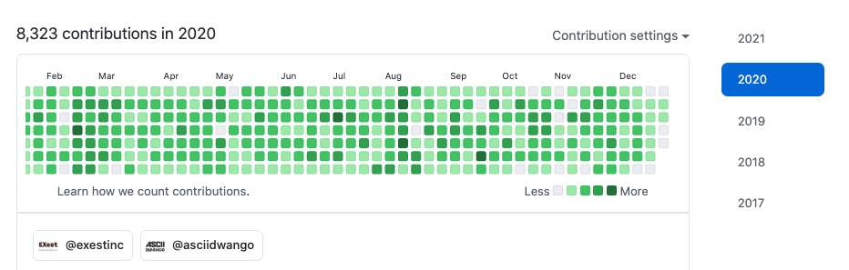

| key      | value                                                 |
| -------- | ----------------------------------------------------- |
| 名前     | 田中建蔵                                              |
| 年齢     | 25 歳                                                 |
| 最終学歴 | 関西大学 法学部 法律政治学科                          |
| GitHub   | [kenzoukenzou](https://github.com/kenzoukenzou)       |
| Twitter  | [@kenzoooooB](https://twitter.com/kenzoooooB)         |
| Qiita    | [@kenz-dev](https://qiita.com/kenz-dev)               |
| connpass | [connpass](https://connpass.com/user/kenzoukenzou/)   |
| Zenn     | [kenzo](https://zenn.dev/kenzo)                       |
| 本棚     | [ブクログ](https://booklog.jp/users/4165b902f43abd44) |

### 職歴

#### 2018 年 4 月 - 2019 年 1 月： [株式会社ワークスアプリケーションズ](https://www.worksap.co.jp/)

プログラミングで業務課題を解決する 1 カ月のインターンシップで評価され新卒社員として入社。ソフトウェアの導入コンサル職として、ERP の導入支援などを担当。在職中は Python を独学し、スカンクワークとして日報提出・勤怠打刻の効率化ツールなどを開発。

2019 年 1 月に退職し、半年間のプログラミングの独学期間を経て転職。

#### 2019 年 8 月 - 現在： [EXest 株式会社](https://www.exest.jp/)

入社後から 2-3 人の少数開発メンバーで、以下の開発してきました。

- 訪日外国人マッチングプラットフォーム「[WOW U](https://www.wowu.jp/)」の保守及び機能追加
- 観光動画プラットフォーム「[DOGADOZO](http://dogadozo.com/)」の新規開発

**WOW U の保守及び機能追加**

リリースが安全に行えるよう今まであまり書けていなかったテストの整備に着手。`simplecov`を使ったカバレッジ計測では 80％以上になるまでテストを追加し、CircleCI を使った自動テスト・デプロイ設定も整備。

**DOGADOZO の新規開発**

[DOGADOZO](http://dogadozo.com/)は、自分が入社したタイミングでスタートしたこともあり、要件定義・設計・実装・テスト・リリースまで一貫して担当しました。以下、DOGADOZO で使用した技術です。

- コード管理：Git, GitHub
- DB：PostgreSQL
- 言語・FW：Ruby, Ruby on Rails
- テスティングフレームワーク：RSpec
- インフラ：Heroku
- AWS：
  - S3
  - CloudFront
  - Lambda
  - Elastic Transcoder
- CI/CD：CircleCI

0 → 1 の事業フェーズでは、ビジネスサイドと認識齟齬が起きないよう要件整理の舵取りをしつつ、デッドラインに間に合うよう要件のトレードオフをしながらゴリゴリとコードを書いて形にすることをやってきました。

また、日々ビジネス要件が変わる中で安全にデリバリーし続けられるよう、プロダクト立ち上げ初期の段階からテスト・CICD 環境を整備し 80-90％のカバレッジを維持し続けてきました。

関連記事: [エンジニア 1 年目でやってきたこと](https://kenzoblog.vercel.app/posts/first-year-as-engineer)

### 性格

- **好奇心ドリブン**：新しい技術を試したり、ソースコードを調べたりして新しい発見をすることが好きです。OSS にも興味があります。
- **改善志向**：ソフトウェアの力を使って課題を解決することに興味があります。
- **チーム志向**：メンバーと協働しながら、世の中に価値を届けていくことが好きです。

### 興味関心

病名は伏せますが高校生の時病気にかかり、勉強に集中できない時期がありました。当時受験のプレッシャーもあり、精神的に追い込まれていた記憶があります。
自分ではどうしようもできなかったその病気の問題を、お医者さんやお薬の力によって助けてもらいました。

この原体験があり、自分の開発リソースは医療への恩返しとして使いたいと考えるようになりました。ヘルステック企業に感心があり、日々情報収集をしています。

関連記事：[【イベントレポート】ヘルスケア ×IT で事業・プロダクト開発を推進する企業の最前線](https://kenzoblog.vercel.app/posts/health-tech-event)

### コンタクト

下記アドレスにご連絡ください。  
dev.kenzo99@gmail.com
