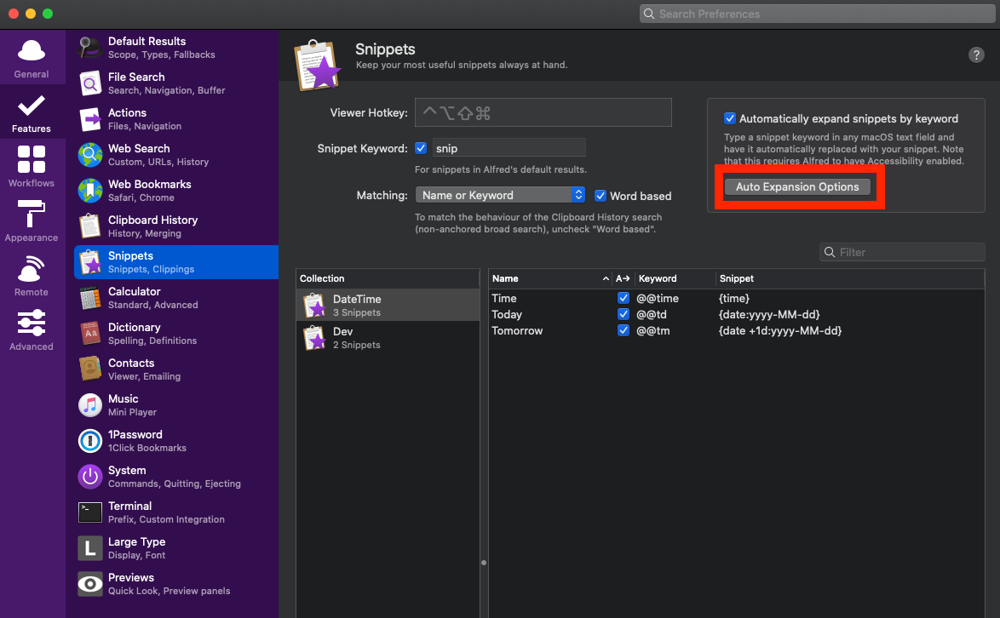

デスクトップアプリ [Alfred](https://www.alfredapp.com/) に課金すると、「スニペット機能」が使えるようになります。このスニペット機能が、VSCode の拡張機能[Markdown All in One](https://marketplace.visualstudio.com/items?itemName=yzhang.markdown-all-in-one)と干渉してうまく使えないことがあったのでメモしておきます。

## 前提

- macOS Catalina: v10.15.6
- Alfred: v4.0.7
- Markdown All in One: v3.4.0

## 発生した事象

Alfred に登録したスニペットを出力した際、一部文字列が削除された状態になってしまう。僕の場合 `@@td` と打つと、今日の日付が `2021-02-23` のように出力するようにしています。

実際に試してみると以下のようになります。

## 解決策

「Markdown All in One」は OSS として公開されていて、上記の事象は Issue でディスカッションされていました。  
[Text snippets don't expand correctly when using text expansion (Alfred, AutoHotKey) · Issue #200 · yzhang-gh/vscode-markdown](https://github.com/yzhang-gh/vscode-markdown/issues/200)

色々やり方はありそうですが、[Issue 内のコメント](https://github.com/yzhang-gh/vscode-markdown/issues/200#issuecomment-636422983)のやり方で解消しました。

Snippets の画面から Auto Expansion Options を開きます。

Tweaking のタブで、Simulated key event speed の設定を真ん中から真ん中よりも左側に設定します。

以上で僕の環境では正常にスニペットを使えるようになりました。
