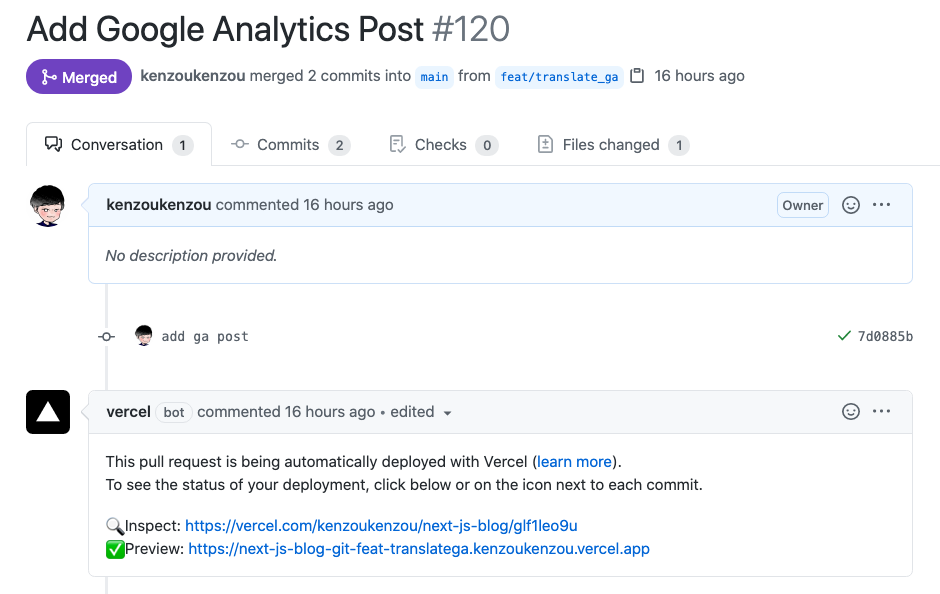
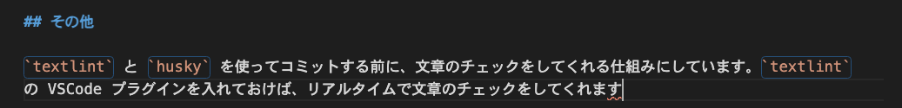

このブログを僕田中建蔵の個人ブログとして、今年の 1 月末頃に立ち上げました。この記事では、ブログを支えている技術を紹介します。

## [Next.js](https://nextjs.org/)

`Next.js` と `TypeScript` を使っています。チュートリアルに掲載されている手順と同じ方法でマークダウンの記事を管理していて、`react-mark-down` を使ってレンダリングを行っています。

画像ファイルを記事から相対パスで読み込めるようにする工夫を入れていて、これに関しては以前記事にしています。  
[Next.js ブログにおける画像ファイル管理](https://kenzoblog.vercel.app/posts/nextjs-blog-asset)

ツイートの埋め込みもちょっとした小技を使っています。もっと良いやり方があれば教えて下さい。  
[Next.js ブログでマークダウンの記事にツイートの埋め込む](https://kenzoblog.vercel.app/posts/tweet-embed-nextjs)

また試験的ですが、記事を執筆中に保存したら自動でリロードしてくれる `next-remote-watch` というライブラリも入れています。

## [Vercel](https://vercel.com/)

`Next.js` プロジェクトの気軽なデプロイ先として、`Vercel` を使っています。Pull Request を作成するとプレビュー環境を作ってくれるところが、個人的に気に入っています。

## [TailwindCSS](https://tailwindcss.com/)

これは最近なのですが、TailwindCSS を導入しました。スタイリングはほぼ Tailwind CSS が用意してくれているものを使用しています。

TailwindCSS を導入すると記事内の見出しのスタイルなども全てリセットされるので、そのあたりは自分で書き直しいたりします。  
[Next.js ブログに Tailwind CSS を導入した際、記事のスタイルがリセットされる問題](https://kenzoblog.vercel.app/posts/update-style-with-tailwind)

## その他

`textlint` と `husky` を使ってコミットする前に、文章のチェックをしてくれる仕組みにしています。`textlint` の VSCode プラグインを入れておけば、リアルタイムで文章のチェックをしてくれます。

Google Analytics を使ってアクセスのトラッキングをしています。設定方法については、先日に翻訳記事を書きましたのでこちらをご参照下さい。  
[【翻訳】NextJS と TypeScript のプロジェクトで Google Analytics を使用する](https://kenzoblog.vercel.app/posts/next-ga)

記事は全て [GitHub](https://github.com/kenzoukenzou/nextJsBlog) 上で公開しているため、もし記事に誤りや typo があった場合には、下記の `Edit on GitHub` リンクから Pull Request を送ってもらえるようにしています。

## まとめ

やっぱりブログを作るのが、自分の場合一番執筆のモチベーションが上がるなと感じました。今後もコツコツ更新していきます。
