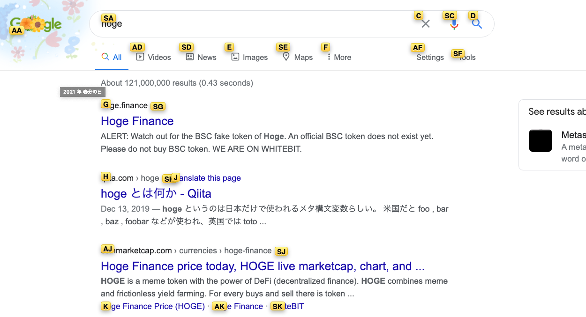
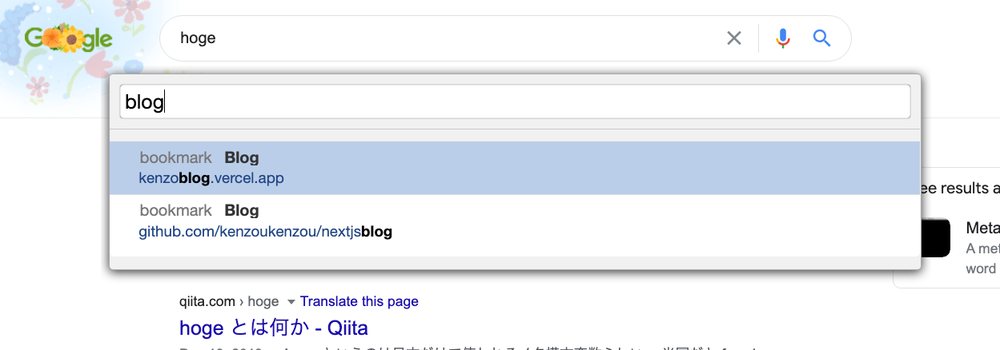
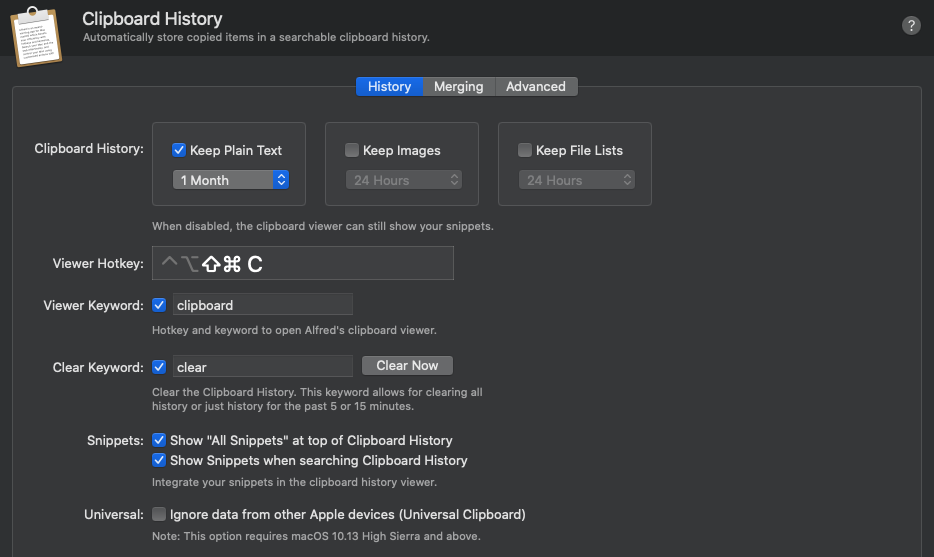
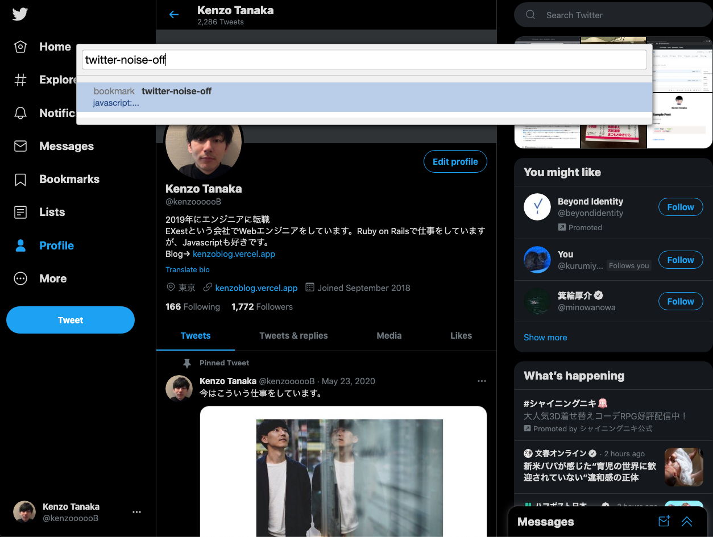

できるだけキーボードから手を離さずキーボードのみで Google Chrome を操作するコツなどをまとめます。

## Chrome や Google calendar などのショートカットを知っておく

- `cmd + l` で現在のタブの URL にフォーカス
  - フォーカスを外すときはタブキーを使う
- `cmd + ←` でブラウザバック
- Google calendar で `w` で週のカレンダーを表示、`m` で月の日程を表示
  - w→Week,m→Month で覚える
- Google calendar で `n` で次の日の予定を表示、 `p` で前の日の予定を表示
  - n→Next,p→Preview で覚える

## GitHub ショートカットを多用する

GitHub のブラウザ版では、色々ショートカットキーを用意してくれています。

- `gc`: Code タブへ移動
- `gi`: Issue タブへ移動
- `gp`: Pull Request へ移動
- `gw`: Wiki へ移動

以下のショートカットキーは、Issue や Pull request の詳細ページで使用できます。

- `a`: アサインを変更
- `l`: ラベルを変更
- `p`: プロジェクトを変更

## Vimium を入れる

[Vimium - Chrome Web Store](https://chrome.google.com/webstore/detail/vimium/dbepggeogbaibhgnhhndojpepiihcmeb?hl=en)

個人的に一番使い込んでいる Chrome 拡張機能です。Vimium をインストールすると、まずページのスクロールが Vim のカーソル移動と同じキーで行なえます。

- `k`: 上へスクロール
- `u`: 上へ大きめのスクロール
- `j`: 下へスクロール
- `d`: 下へ大きめのスクロール

また、`f`キーをクリックすると下記のような表示となり、各リンクにキーがマッピングされるのでそれを打ち込むとリンクをクリックできます。`F`(shfit + f)だと新しいタブで開きます。

さらに `b` をクリックするとブックマークの検索を開くことができます。

ブックマークの検索は Alfred を使ってもいいですが、Vimium を使うと Bookmarklet(ブックマークに JavaScript を仕込んでおき実行するもの)の実行も可能です。僕は Bookmarklet をよく使うので、Vimium のブックマーク検索の方が強力だと思っています。

## Alfred でクリップボードを拡張する

Alfred はクリップボードの拡張できるという点だけでも、課金する価値があると思っています。Alfred を使うと、今まで単にコピーペーストでしか使っていなかったクリップボードを「一時的なテキスト情報の保存先」として使えるようになります。これはいろいろな業務の負担をかなり減らしてくれるものなので、使っていない人がいれば使ってみてほしいです。

[Alfred - Productivity App for macOS](https://www.alfredapp.com/)

僕の場合具体的用途としては例えば、今の現場では毎週 Dropbox Paper で新しい Paper を作成して議事録としているのですが、僕は最新の Paper の URL をクリップボードに入れておいて必要になったらすぐ呼び出せるようにしています。

もちろんクリップボードの履歴はショートカットキーで呼び出せるようにしています。

## Bookmarklet で JavaScript を実行する

ブックマークの URL に JavaScript を仕込んでおくと、このブックマークをクリックすると指定した操作できます。

僕は結構 Bookmarklet 愛用者で、Twitter を見るとに左側のトレンドとかが気になるので非表示にする JavaScript などを使っています。
[twitter-remove-noise.js](https://gist.github.com/kenzo-tanaka/2018f4dedc77784998b7d63769830429)

上述したように Vimium を使えば Bookmarklet を実行できるので、例えば上記 Twitter の例だと以下のような感じです。

↓ `b`キーでブックマークを検索して、ブックマークレットを実行する。

↓ 右側のノイズが表示されなくなる。

