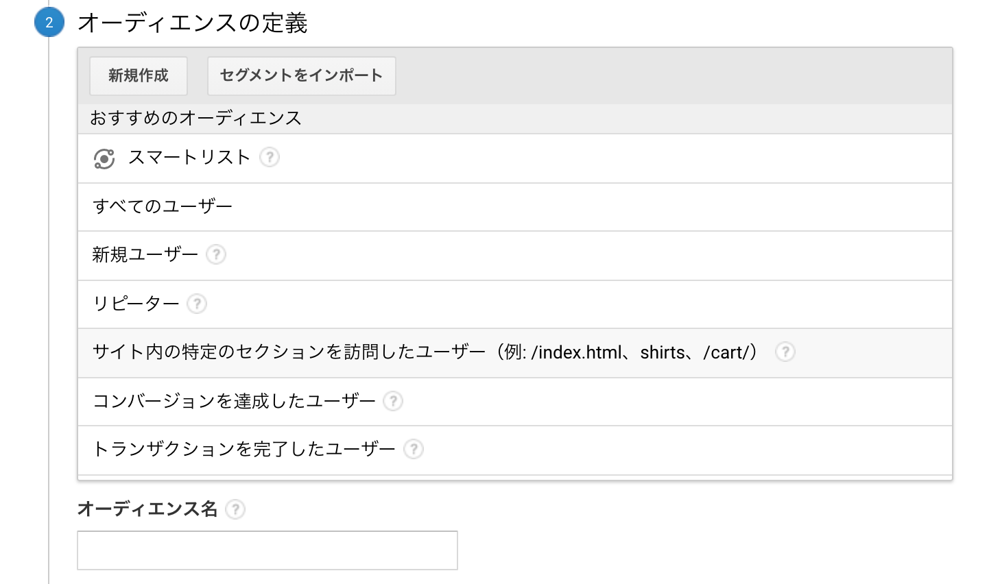
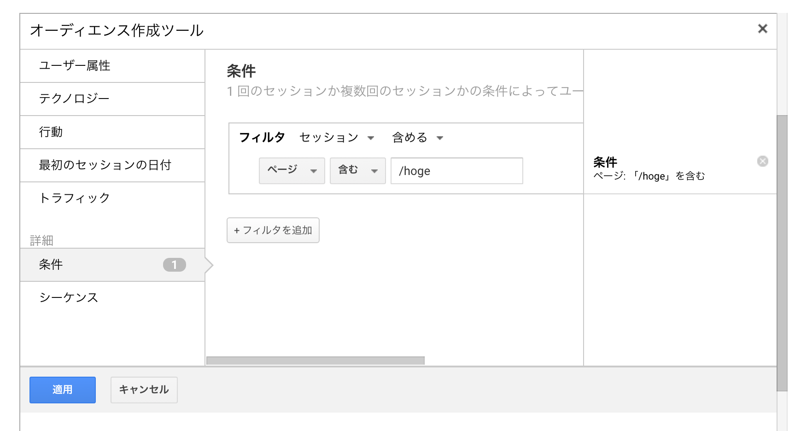
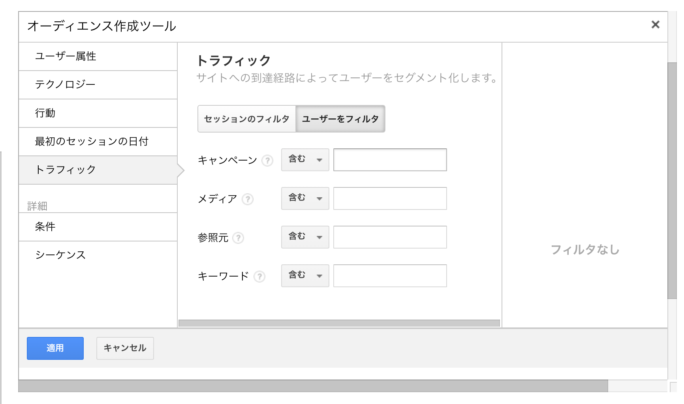
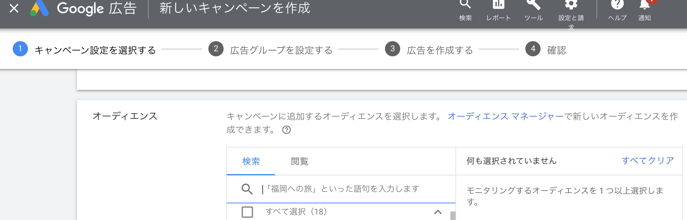

## 前提・やりたいこと

Google 広告経由で既に訪問したことがあるユーザーや、特定のページを閲覧したことがあるユーザーをセグメンテーションして、Google 広告の配信先として使用したい。

## Google Analytics 側設定手順

前提として Google Analytics と Google 広告を連携させる必要がある。設定手順は下記を参照。

[Google 広告とアナリティクスをリンク / リンク解除する - アナリティクス ヘルプ](https://support.google.com/analytics/answer/1033961?hl=ja#zippy=%2C%E3%81%93%E3%81%AE%E8%A8%98%E4%BA%8B%E3%81%AE%E5%86%85%E5%AE%B9)

画面左下の「管理＞プロパティ列のユーザー定義＞オーディエンス」をクリック。

初回は「すべてのユーザー」でオーディエンスを作成する必要があるので、「すべてのユーザー」でオーディエンスを 1 つ作成する。

完了したら「管理＞プロパティ列のユーザー定義＞オーディエンス」に戻り、「新しいオーディエンス」をクリックしてオーディエンスの作成を開始する。

### 例 1：サイトの特定のページを訪問したことがあるユーザーをオーディエンスにしたい場合

「サイト内の特定のセクションを訪問したユーザー」を選択して、編集画面でパスを変更する。

### 例 2：Google 広告経由のユーザーをオーディエンスにしたい場合

「すべてのユーザー」を選択して、「トラフィック」からキャンペーンを選択したり、メディアを選択したりすれば絞り込みできる。

## Google 広告でオーディエンスを使用する

キャンペーンのオーディエンス選択画面で上記で作成したオーディエンスを選択。

