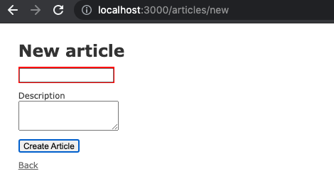
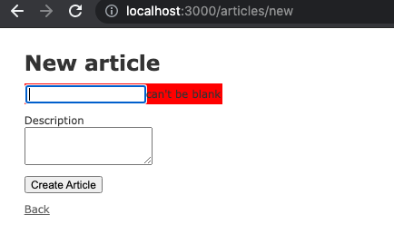
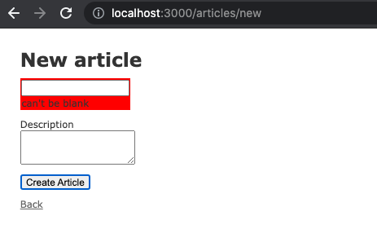
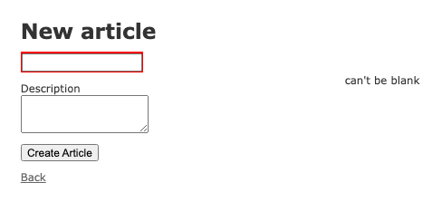

クライアント側でバリデーションをかけられる Gem[DavyJonesLocker/client_side_validations](https://github.com/DavyJonesLocker/client_side_validations)を試してみた。このリポジトリは GitHub のニュースレターで流れてきて知った。

## Gem の紹介

[DavyJonesLocker/client_side_validations](https://github.com/DavyJonesLocker/client_side_validations)

クライアント側で Email のフォーマットなど複雑なバリデーションをかけたいときなどに使える Gem。GitHub スター数も 2021/06 現在で 2.5k ついている。README を見る限りではセットアップも簡単そう。

## セットアップ

```rb:Gemfile
gem 'client_side_validations'
```

```shell
bundle install
```

```shell
# 設定ファイルを作成
rails g client_side_validations:install
```

```shell
# npmパッケージをインストール
yarn add @client-side-validations/simple-form
```

```js:application.js
require('@client-side-validations/client-side-validations');
```

```rb:article.rb
class Article < ApplicationRecord
  validates :title, presence: true, uniqueness: true
end
```

あとは、Rails の`form_for`などに`validate: true`を付与するだけ。

```slim:_form.html.slim
= form_for @article, validate: true do |f|
```

フォームをサブミットするか・エラーのある状態で次の入力に移ろうとすると、JS でバリデーションを検知してくれるようになる。下記は`scaffolds.scss`以外スタイルを入れていないので、input が赤くなるだけ。



## SimpleForm を使う

README で紹介されていたプラグイン SimpleForm を導入してみる。

```rb:Gemfile
gem 'simple_form'
gem 'client_side_validations'
gem 'client_side_validations-simple_form'
```

上記順番に気をつけること。`client_side_validations`は`client_side_validations-simple_form`よりも前じゃないといけない。

```shell
yarn add @client-side-validations/simple-form
```

```js:application.js
require('@client-side-validations/simple-form')
// Bootstrap 4+ with `require` syntax
require('@client-side-validations/simple-form/dist/simple-form.bootstrap4')
```

```slim:_form.html.slim
= simple_form_for @article, validate: true do |f|
```

バリデーションエラーメッセージの表示と、あまりイケてないスタイルが反映される。



バリデーションエラーのときに表示される HTML を変更するには、設定ファイルを書き換える。コメントアウトされているところをアンコメントしてみると少し表示位置が変わっていることを確認できる。



Wiki に書いてあった設定も試してみた。画面右側にエラーメッセージを表示させている感じ。  
[Custom HTML · DavyJonesLocker/client_side_validations Wiki](https://github.com/DavyJonesLocker/client_side_validations/wiki/Custom-HTML)



このあたりのスタイリングは頑張って CSS 書いたり、フレームワークを入れたりすればなんとでもできそう。

## ユニークバリデーションは多分できない

ユニークバリデーションは動作しなかったので、Issue を探ってみたら、サポートを止めたとのこと（DB まで見にいくのがセキュリティ的に微妙だったとかかな）。

> Hi, uniqueness validator support was removed in version 7.0.  
> [Validation for uniqueness not working · Issue #725 · DavyJonesLocker/client_side_validations](https://github.com/DavyJonesLocker/client_side_validations/issues/725)
