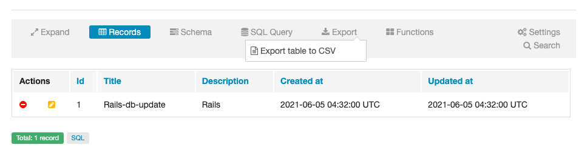

GitHub Explore で流れてきた Gem[igorkasyanchuk/rails_db](https://github.com/igorkasyanchuk/rails_db)を触ってみた。

## 導入

Rails 6.0.3.7 を使っているので以下を Gemfile に追記して、`bundle install`実行。

```rb
# Rails >= 6
gem 'rails_db', '>= 2.3.1'
```

`http://localhost:3000/rails/db`にアクセスするとダッシュボードを見れる。とても簡単。

## 機能

レコードの CRUD ができる。


スキーマを見ることができる。


CSV で Export できる。



SQL Editor で SQL を叩いて、その結果を Export できる。


## 感想

ビジネスサイドからの「こういうデータ欲しいのだけど」という要望に今までは Heroku Dataclips を使っていたのですが、この Gem があればビジネスサイドの人たちで作業を完結できるかも、と思いました。

[Heroku Dataclips が便利という話と PostgreSQL で力技でデータをソートした話](https://kenzoblog.vercel.app/posts/heroku-dataclip)
