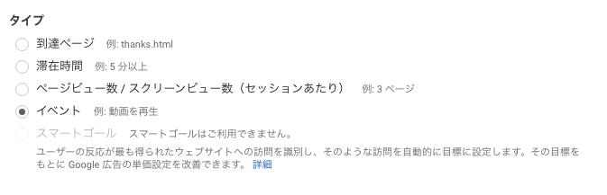
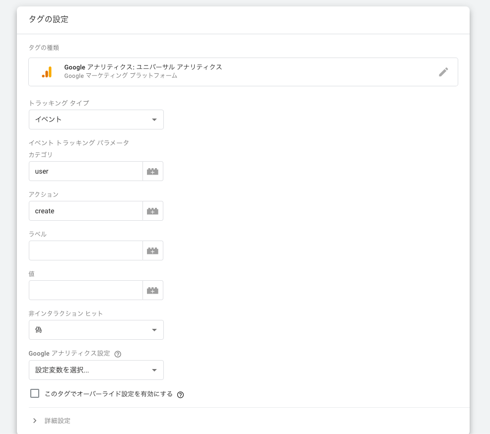
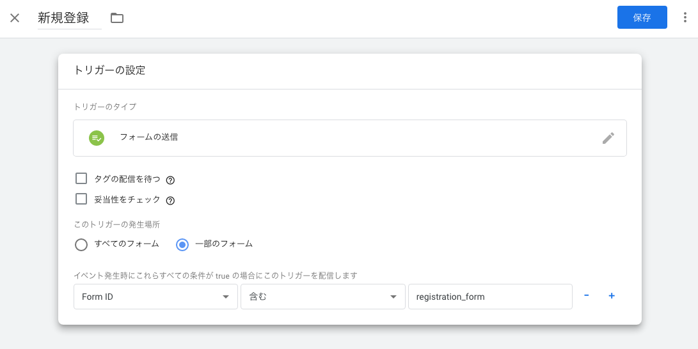

## Google Analytics のコンバージョンとは

Google Analytics のコンバージョンの機能を使えば、資料請求が何件あったか・何人が新規登録したかなど、サイト内で計測したい指標を追うことができます。
[コンバージョン - アナリティクス ヘルプ](https://support.google.com/analytics/answer/6086209?hl=ja)

コンバージョンの設定には「到達ページ」「滞在時間」「イベント」などの測定方法があります。

「到達ページ」などのタイプは GA 上の設定で完結しますが、イベントに関しては色々設定を加えなくてはいけません。大きく以下の 2 つのやり方があります。

- Google Tag Manager を使う
- gtag.js を使う

タイトルの件に関して、gtag を使う方法は[こちらの記事](https://qiita.com/yamitake@github/items/876c6de1b3f7631e802e)に書かれています。  
GTM を使った方法に関しては情報が見当たらず苦戦したので、この記事に残しておきます。

ちなみに Google 的には、GTM を推している雰囲気を感じました。

> If you currently use Tag Manager, you should continue to do so. Google Ads and Google Marketing Platform tags are fully supported by Tag Manager, and there is no need to deploy additional gtag.js-based code on your site if Tag Manager is already in use.  
> [Tag Manager and gtag.js - Tag Manager Help](https://support.google.com/tagmanager/answer/7582054?hl=en#:~:text=Tag%20Manager%20is%20a%20tag,tags%20directly%20to%20web%20pages.)

## 前提

ユーザー新規登録のタイミングでコンバージョンをカウントします。  
GA の「目標」設定で、下記のように設定していると仮定します。

- タイプ: イベント
- カテゴリ: user
- アクション: create

## 方針

新規登録のフォームが送信された時、イベントを発火してコンバージョンとしてカウントする。

## Google Tag Manager(GTM) を使う

Google Tag Manager(以下 GTM)を使う方が gtag.js を使うより実装の変更を最小限に留められます。
GTM に登録した時「Google タグマネージャーをインストール」のポップアップが出るので、これを head タグ内に埋め込んでおきます。

> 新規登録のフォームが送信された時、イベントを発火してコンバージョンとしてカウントする。

この設定を GTM で追加します。まずタグの設定では「Google アナリティクス: ユニバーサルアナリティクス」を選択します。**カテゴリーなどの設定は GA の目標で設定した内容と合わせる必要があります。**

- トラッキングタイプ: イベント
- カテゴリ: user
- アクション: create

👆 の設定途中で GA のトラッキング ID の設定を求められるので、それも設定して下さい。  
[Google アナリティクス設定変数 - タグ マネージャー ヘルプ](https://support.google.com/tagmanager/answer/9207621#ga_id)

トリガーは以下のように設定します。**「すべてのフォーム」設定だとログイン時などにもイベントが走ってしまうので、新規登録フォームに割り振った一意の ID を指定しています。**

上記完了したら、保存して公開をします。設定が問題なく反映されていれば、`id=registration_form`から送信された時、イベントが走ってコンバージョンがカウントされるはずです。
**イベントが想定通りに走っているかを確認するには、GA のリアルタイム > イベントから確認して下さい。コンバージョンがカウントされているかを確認するには、GA のリアルタイム> コンバージョンから確認して下さい。**

## 既知の課題

上記の設定は完全ではなく、フォームがバリデーションエラーで送信できなかったときにもイベントが発火してしまいます。これを防ぐ方法もおそらくあると思うのですが、また分かったら追記します。（あるいは知っている人がいたら教えて下さい 🙏）
