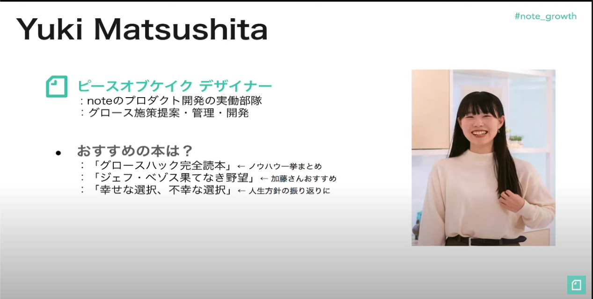

社内でグロースハックに取り組んでおり、参考になるような本がないかと探している時に出会った。グロースハックの指針になる内容が書かれており、社内の取り組みを見直すきっかけになったのでメモしておく。

この本は以下の動画で知った。

[【note イベント】「note の躍進を支えた”定性と定量の甘い関係” ─ データと世界観をどう組み合わせる？」2019/11/14 - YouTube](https://www.youtube.com/watch?v=7nIz4yO2ODA)
