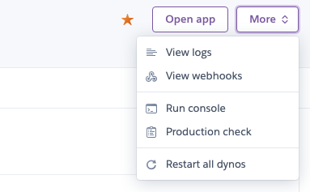

Heroku で不具合等があった際などにログを確認する方法についてです。

## Rollbar を入れておく

Heroku のアドオンとして提供されている Rollbar を入れておくと、エラーの検知がしやすくなります。  
[Rollbar - Add-ons - Heroku Elements](https://elements.heroku.com/addons/rollbar)

アプリケーションで例外が生じたときに、メールや Slack などで通知させることができます。
また Rails アプリケーションで Rollbar の Gem を入れておけば、エラー捕捉時に任意のメッセージとともに Rollbar に通知させるということもできます。

```rb
begin
 # 省略
rescue NoMethodError => e
  Rollbar.error(e)

  # 説明も送信
  Rollbar.error(e, 'The user info hash doesn\'t contain the correct data')
end
```

`ActiveRecord::RecordNotFound`や`ActionController::RoutingError`を拾いたくないという場合には、`rollbar.rb`に設定を加えることで検知しないように設定できます。

[Exception level filters - Ruby](https://docs.rollbar.com/docs/ruby#exception-level-filters)

## Heroku ダッシュボードの Metrics を見る

Heroku ダッシュボードの Metrics タブから Warning や Critical なイベントが起こっているタイミング、メモリ消費、レスポンスタイムを確認できる。

- 期間を過去 2 時間から過去 7 日間まで変えて確認が可能
- タイムゾーンを Asia/Tokyo にすると確認がしやすい

R14 等のエラーコード一覧はこちらで確認できます。  
参考：[Heroku Error Codes | Heroku Dev Center](https://devcenter.heroku.com/articles/error-codes)

僕は以下のような使い方をしています。

- H12(Request timeout)が起こった時間帯にどのようなリクエストがあったかを確認する
- R14 が常態化している場合は、アクセスが集中しているか・Heroku のスペックがアクセス量に対して足りていないか・DDoS 攻撃を受けているかなどを調査

## Heroku ダッシュボードから確認する方法



Heroku ダッシュボードページの右上あたり「View logs」からログの確認ができます。  
僕が使うときは「Autoscroll with output」のチェックをオフにして、自動でスクロールされないようにしてログをじっくり見るようにしています。


Heroku で Application Error が出た場合には、ここで吐き出されているログをみて何が原因かを推測できます。  
また、上記で書いたエラーコードもこのログには表示されるので、エラーコードが出ているタイミングでどのようなリクエストが走っているのかの確認もできます。

## ターミナルからログを確認する方法

上記の Web UI から確認したログを手元のターミナルからも確認できます。

```shell
heroku login # cliからまだログインしていない場合は左記コマンド実行
heroku logs --tail --app app_name # app_nameはアプリケーション名
```

--tail というオプションをつけておくことで、リアルタイムのログを追跡して確認できます。  
また -n オプションで行数を指定してログを出すこともできます。

```shell
heroku logs -n 200
```

参考：[Logging | Heroku Dev Center](https://devcenter.heroku.com/articles/logging)

## アドオン(Papertrail)を使ってログを確認する方法

Heroku のアドオンである Papertrail を入れておくとログの確認や、エラーの検知がしやすくなります。  
[Papertrail - Add-ons - Heroku Elements](https://elements.heroku.com/addons/papertrail)

- 検索キーワードを含む行だけを表示
- H, R 系のエラー発生時にはメール通知

無料プランでは上限があるので、規模が大きくなってきたら有料に乗り換えた方が良いでしょう。
