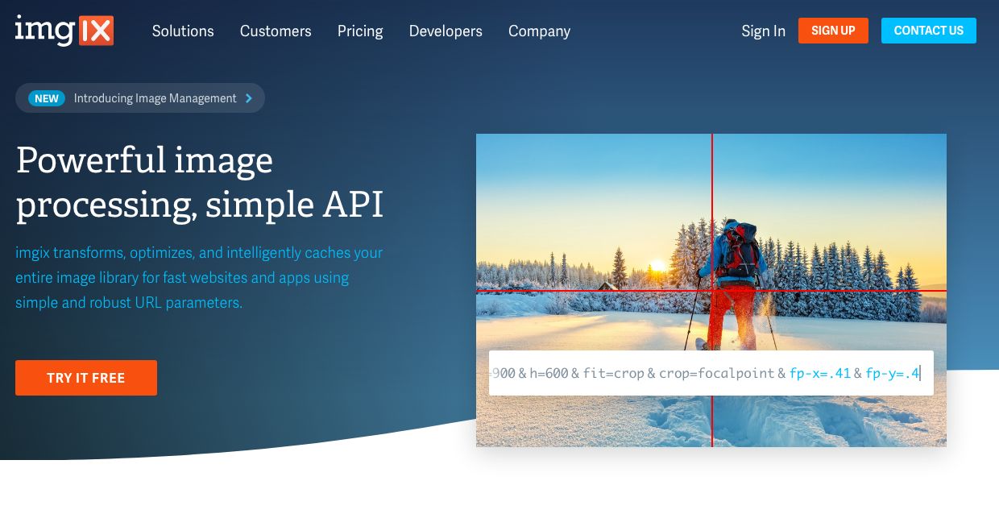

業務で imgix-rails をがっつり触ってパフォーマンスの改善をしたので、調べたことなどをメモしておきます。

## imgix とは


[Image processing and optimization API - Image CDN • imgix](https://www.imgix.com/)

画像のリサイズ、整形、最適化、キャッシュなどを行ってくれる CDN です。
URL にパラメータを付与するだけで画像のサイズやフォーマットを変えたりできます。

CloudFront などに比べると管理画面が分かりやすく、リサイズやフォーマットの設定までできるところが imgix の強力さかなと思います。

この記事では S3 を向き先として想定していますが、Google Cloud Storage や Microsoft Azure とかも設定できるみたいです。  
[Creating Sources | imgix Documentation](https://docs.imgix.com/setup/creating-sources)

## imgix-rails を使う

imgix 公式が出している Gem [imgix-rails](https://github.com/imgix/imgix-rails)を使えば手軽に Rails プロジェクトに imgix を導入できます。

設定として application.rb に以下の設定を書きます。ステージングなど環境ごとで切り替えたい場合には、環境変数を使って書くのが良いと思います。

```rb:application.rb
Rails.application.configure do
  config.imgix = {
    source: ENV['IMGIX_SOURCE']
  }
end
```

view 側では`ix_image_tag`を使用すれば、imgix から配信された URL をレンダリングしてくれるようになります。第一引数には画像のパス（S3 でいうとキー）を指定、`url_params`には画像のサイズなどを設定できます。

```erb
<%= ix_image_tag('/unsplash/hotairballoon.jpg', url_params: { w: 300, h: 500, fit: 'crop', crop: 'right'}, tag_options: { alt: 'A hot air balloon on a sunny day' }) %>
```

## 注意点：デフォルト設定で Source を作成すると非公開バケット内のオブジェクトも参照できてしまう

非公開バケットの一部のディレクトリだけ imgix から配信して、他のディレクトリにはアクセスできないようにしたいという場合を考えてみます。

```shell
/secret_bucket
  /dir_a # imgixで配信したい
  /dir_b # これは非公開のままにしたい
```

この場合、**特にデフォルト設定から何も変えずに imgix で Source を作成すると、非公開バケットの全てのオブジェクトを参照できるようになってしまいます。**

これを回避するため imgix には Secure URLs という仕組みがあります。これを使うと token の情報なしにアクセスすることを防ぐことができます。
[Securing Images | imgix Documentation](https://docs.imgix.com/setup/securing-images#expiring-urls)
