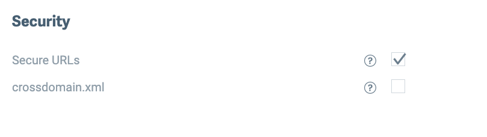
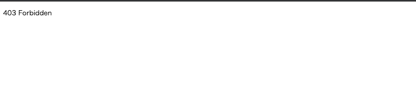
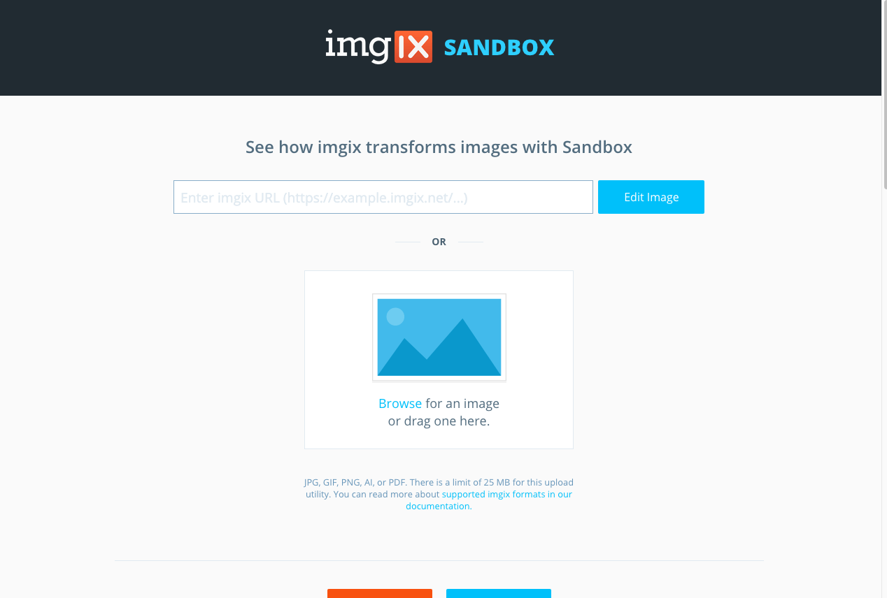
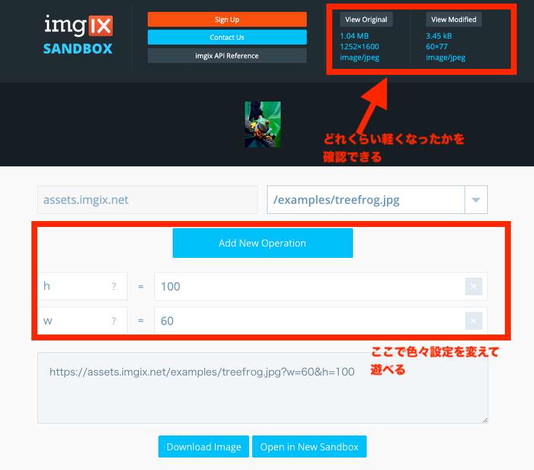

最近 imgix-rails でパフォーマンスの改善をしたので、調べたことや注意点などをまとめておきます。

## imgix とは


[Image processing and optimization API - Image CDN • imgix](https://www.imgix.com/)

画像のリサイズ、整形、最適化、キャッシュなどを行ってくれる高機能な CDN です。
URL にパラメータを付与するだけで、手軽に画像のリサイズやフォーマット変更など色々なことができます。

CloudFront に比べると管理画面が分かりやすく、リサイズやフォーマットの設定までできるところが imgix の強力さかなと思います。この記事では S3 を向き先として想定していますが、Google Cloud Storage や Microsoft Azure なども設定できます。  
[Creating Sources | imgix Documentation](https://docs.imgix.com/setup/creating-sources)

## imgix-rails を使う

imgix 公式が出している Gem [imgix-rails](https://github.com/imgix/imgix-rails)を使えば手軽に Rails プロジェクトに imgix を導入でき、必要なパラメータ設定などもしっかり網羅してくれています。  
ドキュメント：[Rails library for imgix | imgix-rails | imgix Documentation](https://docs.imgix.com/libraries/imgix-rails)

application.rb に以下の設定を書きます。ステージングなど環境ごとで Source を切り替えたい場合には、環境変数を使って書くのが良いと思います。

```rb:application.rb
Rails.application.configure do
  config.imgix = {
    source: ENV['IMGIX_SOURCE']
  }
end
```

view 側では`ix_image_tag`を使用すれば、imgix から配信された URL をレンダリングしてくれます。引数には画像のパス（S3 でいうとキー）を指定、`url_params`には画像のサイズなどを設定できます。その他引数で設定できる項目は、[ここ](https://github.com/imgix/imgix-rails#ix_image_tag)に記載されています。

```erb
<%= ix_image_tag('/unsplash/hotairballoon.jpg', url_params: { w: 300, h: 500, fit: 'crop', crop: 'right'}, tag_options: { alt: 'A hot air balloon on a sunny day' }) %>
```

## 注意点：デフォルト設定で Source を作成すると非公開バケット内のオブジェクトも参照できてしまう

非公開バケットの一部のディレクトリだけ imgix から配信して、他のディレクトリにはアクセスできないようにしたいという場合を考えてみます。

```shell
/secret_bucket
  /dir_a # imgixで配信したい
  /dir_b # 非公開のままにしたい
```

この場合、**特にデフォルト設定で Source を作成すると、非公開バケットの全てのオブジェクトを参照できるようになってしまいます。**

これを回避するため imgix には Secure URLs という仕組みがあります。これを使うと token の情報なしにアクセスできなくなります。  
[Securing Images | imgix Documentation](https://docs.imgix.com/setup/securing-images#expiring-urls)

Source を作成する時の画面下部で、下記のようなチェックボックスがあるのでこれを ON にしておけば、ダッシュボード側での設定は完了です。


これを imgix-rails 側で設定する必要があるので、application.rb を下記のように書き換えます。

```rb:application.rb
Rails.application.configure do
  config.imgix = {
    source: ENV['IMGIX_SOURCE']
  },
  secure_url_token: ENV['IMGIX_SECURE_URL_TOKEN']
end
```

こうすれば、token によって発行される乱数が`s`パラメータに付与されます。セキュアな URL は expires パラメータで明示的に有効期限をセットできます。期限が切れると画像は参照できなくなり 404 を返します。


トークンが付与されていない URL でオブジェクトを参照しようとすると、403 Forbidden を返します。



## 複数の Source からの配信

imgix では複数の Source を設定して、ix_image_tag で出し分けができます。`sources`には Source のドメインと Token のハッシュを渡します。上述した Secure URLs の設定を入れていない場合には、value に nil を渡します。

```rb:application.rb
Rails.application.configure do
  config.imgix = {
    sources: {
      "assets.imgix.net"  => "foobarbaz",
      "assets2.imgix.net" => nil,   # Will generate unsigned URLs
    },
    default_source: "assets.imgix.net"
  }
end
```

[Multi-source configuration - imgix/imgix-rails](https://github.com/imgix/imgix-rails#multi-source-configuration)

`ix_image_tag`での Source の切り替えは、第一引数に配信したい Source のキーを渡します。

```erb
<%= ix_image_tag('assets2.imgix.net' ,'/path-to-img.jpg') %>
```

第一引数を省略した場合は、`default_source`でセットした Source を見に行きます。

```erb
<%= ix_image_tag('/path-to-img.jpg') %>
```

## どれくらい画像が軽くなるのか確認したい



[imgix Sandbox](https://sandbox.imgix.com/create)を使うと便利です。URL に付与するパラメータを画面で色々操作できて、右上の方でどれくらい軽量化されたかも確認できます。



## 遅延ロードもやりたい

imgix が推している lazysizes という遅延ロード用のライブラリに関しても書いておきます。

- [Improving Site Performance | imgix Documentation](https://docs.imgix.com/best-practices/improving-site-performance#lazy-loading-and-responsive-images-with-imgixjs)
- [imgix Blog | Using imgix with lazysizes](https://blog.imgix.com/2016/05/02/imgix-lazysizes)
- [aFarkas/lazysizes | GitHub](https://github.com/aFarkas/lazysizes)

公式の手順に沿って lazysizes をインストールして、application.js とかでインポートします。

```shell
$ npm install lazysizes --save
```

```js:application.js
import 'lazysizes';
// import a plugin
import 'lazysizes/plugins/parent-fit/ls.parent-fit';
```

あとは ix_image_tag 側を色々いじります。

```erb
<%= ix_image_tag('/path-to-img.jpg', attribute_options: { src: 'data-src', srcset: 'data-srcset', sizes: 'data-sizes' }, tag_options: { class: 'lazyload' }) %>
```

ここまでやれば激重な Rails プロジェクトでも多少は動作が軽くなるのではと思います。
