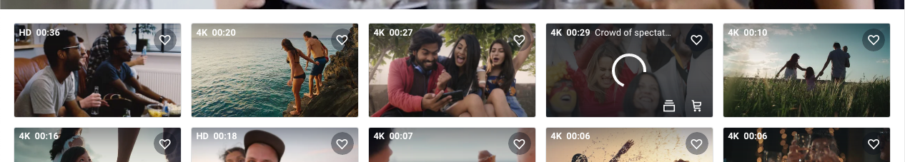

Shutterstock のように動画サムネイルにホバーした時、スタイルを変更するという実装を最近やったので、そのメモです。

こんな感じの動きを作りたい ↓


## 前提

一覧ページで video タグが`preload: none`の指定付きで表示されている。この video タグにホバーされた時、動画を再生するようにしたい。  
[JavaScript で動画のホバー再生・停止を実装する](https://kenzoblog.vercel.app/posts/js-video-play-pause)の続きです。

補足:  
Shutterstock では最初から video タグを表示させるのではなくて、img タグでサムネイル画像を表示させておき、ホバーされたら video タグを差し込むみたいなことをやっているようでした。

## 実装方針

- 動画カードにホバーした時のスタイルを事前に用意しておく
- ホバーされたかつ、動画の読み込みがまだ完了していないときは、読み込み中のスタイルを適用
- 動画が再生可能な状態になれば、読み込み中のスタイルを剥がして動画を再生
- ホバーが外れた時、動画を停止してローディングのスタイルなどが当たっていれば剥がす

## 動画カードにホバーした時のスタイルを事前に用意しておく

ローディングしている時のスタイルを適用する関数を作ります。Shutterstock のようにサムネイルを若干暗くして、ローディングアイコンを表示させると良いかと思います。

```js
document.querySelectorAll("video").forEach((video) => {
  // ローディングしている時のスタイルを適用する関数
  const styleForLoad = () => {};
});
```

[How To Make a Loader](https://www.w3schools.com/howto/howto_css_loader.asp)

## ホバーされたかつ、動画の読み込みがまだ完了していないときは、読み込み中のスタイルを適用

ホバーされてなおかつ動画の読み込みがまだ完了していないときは、上記の関数を適用します。「動画を読込中か」の判定では、`HTMLMediaElement: waiting event`を使うのが良いかとおもいます。

[HTMLMediaElement: waiting event - Web APIs | MDN](https://developer.mozilla.org/en-US/docs/Web/API/HTMLMediaElement/waiting_event)

```js
document.querySelectorAll("video").forEach((video) => {
  // ローディングしている時のスタイルを適用する関数
  const styleForLoad = () => {};
  video.addEventListener("mouseover", () => {
    video.addEventListener("waiting", styleForLoad);
    video.play();
  });
});
```

## 動画が再生可能な状態になれば、読み込み中のスタイルを剥がして動画を再生

「動画が再生可能な状態か」の判定では、`HTMLMediaElement: canplay event`を使います。

[HTMLMediaElement: canplay event - Web APIs | MDN](https://developer.mozilla.org/en-US/docs/Web/API/HTMLMediaElement/canplay_event)

```js
document.querySelectorAll("video").forEach((video) => {
  // ローディングしている時のスタイルを適用する関数
  const styleForLoad = () => {};
  const styleForPlay = () => {
    // ローディングなどを非表示にする
    video.play(); // 動画の再生を再開
  };
  video.addEventListener("mouseover", () => {
    video.addEventListener("waiting", styleForLoad);
    video.addEventListener("canplay", styleForLoad);
    video.play();
  });
});
```

## ホバーが外れた時、動画を停止してローディングのスタイルなどが当たっていれば剥がす

ホバーが外れたときには`removeEventListener`を使って、ホバー時に登録したイベントリスナを剥がします。こうしないと、`waiting`→`canplay`をトリガーにイベントがずっと走ってしまう(動画の再生がホバーを外しても継続してしまう)ためです。

[EventTarget.removeEventListener() - Web APIs | MDN](https://developer.mozilla.org/en-US/docs/Web/API/EventTarget/removeEventListener)

```js
document.querySelectorAll("video").forEach((video) => {
  // ローディングしている時のスタイルを適用する関数
  const styleForLoad = () => {};
  const styleForPlay = () => {
    // ローディングなどを非表示にする
    video.play(); // 動画の再生を再開
  };
  video.addEventListener("mouseover", () => {
    video.addEventListener("waiting", styleForLoad);
    video.addEventListener("canplay", styleForLoad);
    video.play();
  });

  video.addEventListener("mouseout", () => {
    video.removeEventListener("waiting", styleForLoad);
    video.removeEventListener("canplay", styleForLoad);

    // pauseが非同期のplayを邪魔しないよう、thenの中に入れる
    video.play().then(function () {
      video.pause();
    });
  });
});
```
