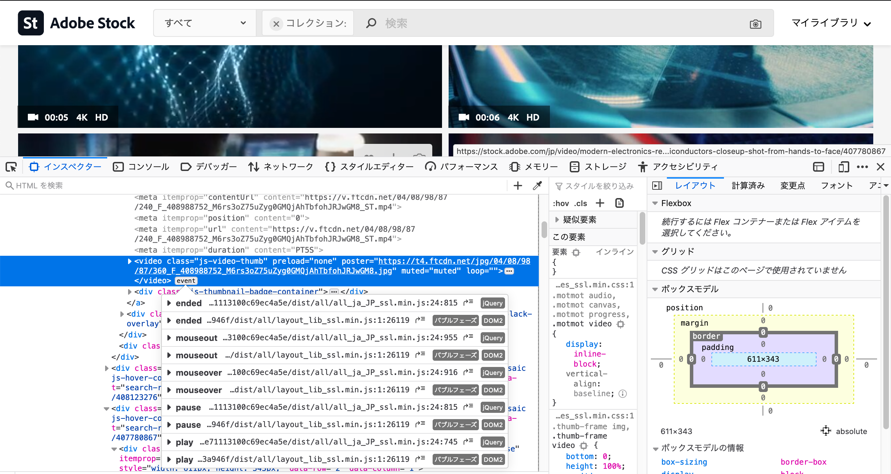

仕事で JavaScript を使った動画のホバー再生を実装した時に、色々苦戦したのでメモです。

## やりたいこと

- 動画一覧ページで表示している video タグに対してホバーした時に動画を再生したい
- ホバーを外したときには動画再生を停止したい
- イメージとしては[shutterstok](https://www.shutterstock.com/ja/video/featured/Together-Again-Stock-Footage-294196007)や[Adobe stock](https://stock.adobe.com/jp/collections/UUcTLZzjqflZi38Tr6tjCc2py2yjOI2j)のような感じ

## video タグには preload: none を付与

動画の一覧で表示する video タグには、`preload`属性を none に指定します。こうすることでブラウザが事前に読み込むことがなくなるため、パフォーマンスが悪化するのを防ぐことができます。

[video : The Video Embed element - HTML: HyperText Markup Language | MDN](https://developer.mozilla.org/en-US/docs/Web/HTML/Element/video)

## シンプルなホバー再生を実装してみる

シンプルに全ての video タグに対して、`mouseover`と`mouseout`のイベントリスナーを登録してみます。
この実装だと、`DOMException: The play() request was interrupted`というエラーがコンソール上に表示されます。

```js
document.querySelectorAll("video").forEach((video) => {
  video.addEventListener("mouseover", () => {
    video.play();
  });

  video.addEventListener("mouseout", () => {
    video.pause();
  });
});
```

Google の開発ブログにこのエラーに関しての記事があります。何が起こっているのかを記事から意訳すると以下の通りです。

- `video.play()`が動画コンテンツを非同期で読み込み始める
- `video.pause()`が動画の読み込みに割り込みする（動画の読み込みがまだ完了していないので）
- `video.play()` が非同期的に拒否する

上記のコード例だと、`mouseover`した時に動画読み込みを開始してすぐに`mouseout`されると、動画の読み込みが完了していないところで、`pause()`が走ってしまうので、`DOMException: The play() request was interrupted`エラーになるという感じです。

## `video.pause()`を改善する

動画を停止するところのコードを改善しました。`play()`が Promise を返すので、`video.play().then()`とすることで`pause()`が動画再生に割り込みすることがなくなります。

```js
document.querySelectorAll("video").forEach((video) => {
  video.addEventListener("mouseover", () => {
    video.play();
  });

  video.addEventListener("mouseout", () => {
    // pauseが非同期のplayを邪魔しないよう、thenの中に入れる
    video.play().then(function () {
      video.pause();
    });
  });
});
```

## 補足: Firefox を使うとイベントリスナーの確認がしやすい

上記実装をするにあたり他の動画系サイトの実装を参考にしました。その際、Firefox の検証ツールが便利でした。
こんな感じで各 DOM にどういったイベントが紐付いているかを簡単に調べることができます。



```twitter
1387677745593810952
```
