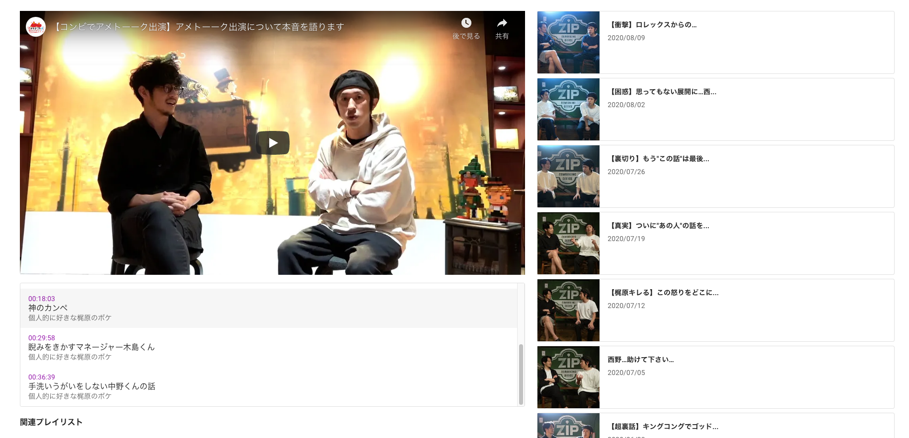
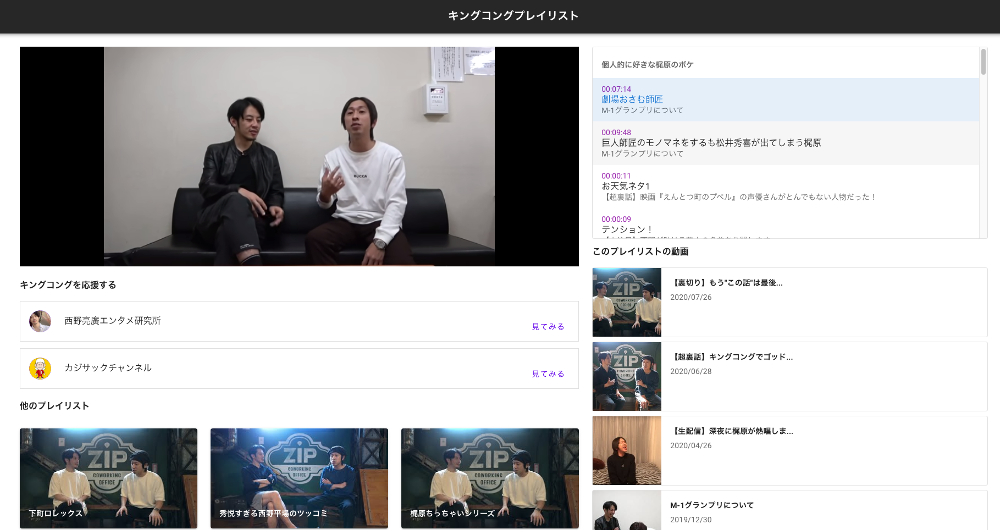

半年前から、**[キングコングプレイリスト](https://playlist-2bf49.web.app/)** というサービスを作り始めました。
ここでは開発した背景や、使用技術などについてまとめます。

## 背景

僕は「[毎週キングコング](https://www.youtube.com/user/mainichikingkong)」という雑談チャンネルを観るのが好きで、おじさん芸人 2 人が喋るのをみることが週末の娯楽だったりします。  
ただこのチャンネルは「ただ雑談するだけ」という性質上、話があっちこっち行きます。他の Youtuber さんみたく、1 動画に 1 つのテーマというわけではないんですね。  
つまり **「あの話面白かったからまた観たいけれど、どの動画だったっけな...」と探すのが難しい** わけです。

「**動画の中で面白かったくだりをタイムスタンプで保存して、それを後でまとめて見返せるサービスがあれば良いな**」と思ったので、キングコングプレイリストを作りました。

## 何ができるか

個人の娯楽&開発学習のため作成したサービスなので、現時点では一般ユーザーの新規登録導線はありません。僕だけがタイムスタンプ・プレイリストを登録できます。

まず動画に対して、タイムスタンプを保存できます。タイムスタンプは押すと、その秒数から動画がスタートします。

各タイムスタンプはプレイリストに保存されるので、あとでプレイリストを見返すこともできます。例えば、「[梶原のボケシリーズ](https://playlist-2bf49.web.app/playlists/2)」では動画内で梶原さんがボケた箇所だけまとまっていて、タイムスタンプを押すとその動画のその秒数から動画が再生されます。

- [サービス URL](https://playlist-2bf49.web.app)
- [ソースコード](https://github.com/kenzoukenzou/kingkong_playlist)

## 使用した技術

普段使い慣れている Rails を使いつつ、フロントエンドは Vue.js を採用しました。
以下が使用技術の詳細です。

- バックエンド：
  - Ruby on Rails(API モード)
  - Postgresql
  - Heroku
  - YouTube Data API
- フロントエンド：
  - Vue.js
  - Vuetify
  - Firebase

初期データとしての動画 50 件は、[YouTube Data API](https://developers.google.com/youtube/v3)をバッチ処理で叩いて、DB に動画の ID を格納しました。後述するライブラリのプロパティに動画の ID を渡すことで、詳細ページの動画埋め込みを表示しています。  
また、毎週キングコングは「毎週日曜日の夜 22 時に動画がアップロードされる」という規則性があるため、API を定時に叩いて最新の動画 1 件を取得してくるようにしています。

バッチ処理は、`app/oneshot`下に入れています。  
[app/oneshot](https://github.com/kenzoukenzou/kingkong_playlist/tree/master/backend/app/oneshot)

動画の再生周りは、[vue-youtube](https://github.com/anteriovieira/vue-youtube)というライブラリを使用しています。  
このライブラリを使うと、動画の一時停止/再生などの制御しやすかったため採用しました。

フロントエンドのスタイリングには、[Vuetify](https://vuetifyjs.com/)を採用しました。  
リッチな見た目を実現しつつ、画像の遅延ロード・検索のサジェスト・スケルトンなども提供されていて、非常に便利で助かっています。

Rails は業務で使い慣れてはいるものの、普段はモノリシックなアプリケーション開発がメインで、API モードでゴリゴリ書くのは初めてで色々分からないところも出てきました。API の設計については、本などを読んで詳しく勉強したいと考えています。

このサービスは個人で使用することが目的だったので、開発速度・表示速度をトッププライオリティとして SPA にしました。
ただ後述しますが、SEO 対策ももう少しやれば良かったと後悔しています。

## 既知の課題

以下の点については、今後対応していく予定です。

**SEO 対策ができていない**  
SEO 対策はゼロで、ソーシャルでも宣伝していないのですが、さすがにサイト名「キングコングプレイリスト」で検索したときにヒットしないのはまずいと思い始めました。
SPA における SEO 対策は全く知見がないため、キャッチアップしながらできる手を打っていこうかなと。

**一般ユーザーにも機能を開放するため、新規登録機能を作る**  
毎週キングコングは 30 万人以上の登録者がいて、時々「急上昇」にもあがったりするので、このサービスを求めている人は僕以外にもいるでしょう。  
ただ、現時点では僕以外のユーザーがプレイリストやタイムスタンプを登録できないようにしているので、そこを整備していきたいと考えています。
