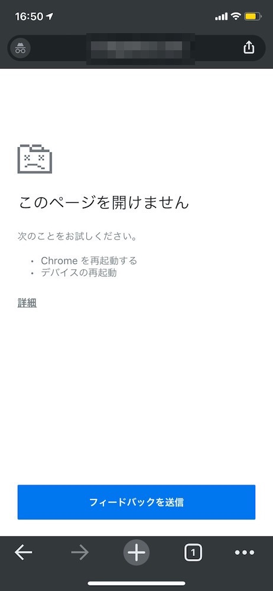

とある事情で複数の input に対して、`autofocus: true`と設定していたとき、iOS Chrome/Safari の環境で以下のページが表示されるエラーとなった。

## autofocus は複数のフィールドに設定してよいか

MDN を見ると以下の記述があるため、複数設定することは想定されているはず。下記の引用の通り、複数の指定があったときは、最初の要素にフォーカスされるという仕様。

> もし複数あった場合、属性がセットされた最初の要素 (通常はページの最初の要素) が初期のフォーカスを得ます。
> [HTMLSelectElement.autofocus - Web API | MDN](https://developer.mozilla.org/ja/docs/Web/API/HTMLSelectElement/autofocus)

## Turbolinks が原因？

Turbolinks のリポジトリで同様の事象を再現している Issue を見つけた。2020/11 月に作成されていてまだクローズされていない。  
[multiple autofocus inputs problems in Mobile Safari / embedded webkit in turbolinks-ios · Issue #589 · turbolinks/turbolinks](https://github.com/turbolinks/turbolinks/issues/589)

事象を再現する Demo ページも用意されている。  
[Page Two | Turbolinks Demo](https://turbolinks-ios14-autofocus.glitch.me/two.html)

上記 Issue のコメントにて。

> Definitely seems to be turbolinks related because on hard refresh the page works and adding `data: { turbolinks: "false" }` to my signup links worked as a hotfix for me.
