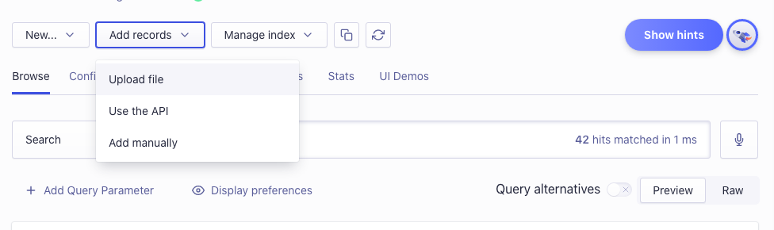
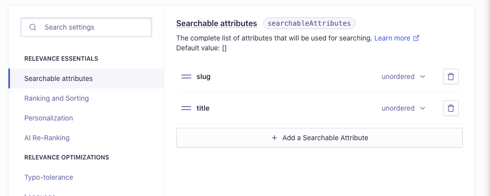

Next．js x Vercel で構成されている当ブログに Algolia 検索を導入しました。  
[検索](https://kenzoblog.vercel.app/search)

PR は以下にまとめています。  
[Feat/Algolia by kenzo-tanaka · Pull Request #205 · kenzo-tanaka/nextJsBlog](https://github.com/kenzo-tanaka/nextJsBlog/pull/205)

実装手順などを書きます。

## 必要なパッケージをインストール

```shell
npm install algoliasearch
npm install react-instantsearch-dom
npm install instantsearch.css # 検索をいい感じにスタイリングしてくれるCSSファイル
```

## Algolia に登録/インデックスを追加/検索対象の属性登録

### 登録

[Sign in | Algolia](https://www.algolia.com/users/sign_in)

### インデックスを追加

インデックスの登録。JSON ファイルのアップロードができるので、ブログのマークダウンファイルのメタデータを JSON ファイルに書き出してアップロードする。

```js:functions/test.ts
import fs from "fs";
import { getSortedPostsData } from "../lib/posts";

const getArticleMeta = () => {
  const posts = getSortedPostsData(); // メタデータを取得してくる
  const data = JSON.stringify(posts); // ファイルに書き込みできるよう変換

  fs.writeFile("algolia.json", data, (err) => {
    if (err) throw err;
    console.log("正常に書き込みが完了しました");
  });
};

getArticleMeta();
```

これを npm スクリプトで実行できるよう下準備する。

```json:tsconfig.builder.json
{
  "extends": "./tsconfig.json",
  "compilerOptions": {
    "module": "commonjs",
    "outDir": "dist",
    "noEmit": false
  },
  "exclude": ["node_modules"],
  "include": ["functions/*.ts"]
}
```

```json:package.json
"scripts": {
  "algolia": "ts-node --project tsconfig.builder.json ./functions/test.ts",
},
```

この辺りの書き方は[catnose99/team-blog-hub: RSS based blog starter kit for teams](https://github.com/catnose99/team-blog-hub)を参考にさせて頂きました。

```shell
npm run algolia
```

生成された JSON ファイルをダッシュボードの Upload file でアップロードする。



### 検索対象の属性を登録

僕は記事の `slug`と`title`を検索対象としました。



## 検索機能の実装

### スタイルを読み込み

```tsx:pages/_app.tsx
import "instantsearch.css/themes/satellite.css";
```

### 環境変数のセット

```.env.local
ALGOLIA_APP_ID=xxx
ALGOLIA_API_KEY=xxx
```

```js:next.config.js
module.exports = withPlugins([[optimizedImages, {}]], {
  // 省略
  env: {
    ALGOLIA_APP_ID: process.env.ALGOLIA_APP_ID,
    ALGOLIA_API_KEY: process.env.ALGOLIA_API_KEY,
  },
});
```

### 検索用コンポーネントを作成

```tsx:components/search.tsx
import React from "react";
import algoliasearch from "algoliasearch/lite";
import Link from "next/link";
import {
  SearchBox,
  Hits,
  Highlight,
  InstantSearch,
} from "react-instantsearch-dom";

const algoliaSettings = {
  searchClient: algoliasearch(
    `${process.env.ALGOLIA_APP_ID}`,
    `${process.env.ALGOLIA_API_KEY}`
  ),
  // ここは自分が作ったインデックス名にする
  indexName: "kenzo_blog",
};

const Hit = ({ hit }: any) => {
  return (
    <div className="hit">
      <Link href={`/posts/${hit.slug}`}>
        <a>{hit.title}</a>
      </Link>

      <div className="hitName">
        <Highlight attribute="name" hit={hit} />
      </div>
    </div>
  );
};

const SearchResult = () => {
  return (
    <div className="search-result">
      <Hits hitComponent={Hit} />
    </div>
  );
};

const Search: React.FC = () => {
  return (
    <>
      <InstantSearch
        searchClient={algoliaSettings.searchClient}
        indexName={algoliaSettings.indexName}
      >
        <SearchBox translations={{ placeholder: "search..." }} />
        <SearchResult />
      </InstantSearch>
    </>
  );
};

export default Search;
```

### 検索用ページで読み込み

```tsx:pages/search.tsx
import Layout from "../components/layout";
import Search from "../components/search";
import { PageSEO } from "../components/pageSEO";

const SearchPage = () => {
  return (
    <Layout>
      <Search />
      <PageSEO title="検索" />
    </Layout>
  );
};

export default SearchPage;
```
