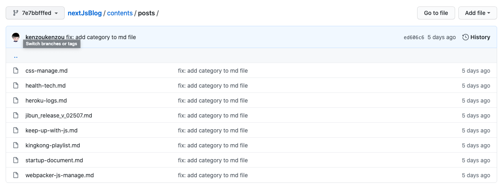
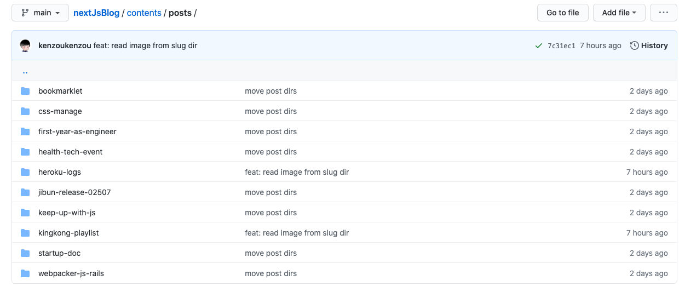

このブログは Next.js で作られているのですが、始めた当初はマークダウンファイルのディレクトリ構成は以下のキャプチャのようになっていました。

`/contents/posts/` 下に `<slug>.md` があるような形です。


各 `slug/` をディレクトリにして、その下に`index.md`と画像ファイルを置く方が、ファイル管理が楽になると考えました。



つまりディレクトリ構成はこんな感じです。

```shell
# article1 とかが slug になる
/contents
  /posts
    /article1
      index.md
      img1.png
      img2.png
    /article2
      index.md
      img2.png
      img3.png
```

この状態にして下記のように画像を読み込めるようになれば、記事執筆がストレスフリーになりますし、静的ファイルの管理もより直感的になると考えました。

```md

```

上記の状態を実現するために行った修正をまとめます。

## 前提・環境

記事は `/contents/posts/slug/index.md` で Markdown 記法で書かれていて、記事を HTML としてレンダリングするために `react-markdown` を使用しています。

- `next`: ^10.0.0
- `react`: 17.0.1
- `react-dom`: 17.0.1
- `react-markdown`: ^5.0.3

## 単純に相対パスを指定するだけでは画像は読めない

マークダウンファイルから単純に相対パスを指定する方法では画像は読み込めません。Next.js では `public` から静的ファイルを配信するので、そちらを見に行ってしまいます。

[Basic Features: Static File Serving | Next.js](https://nextjs.org/docs/basic-features/static-file-serving)

## 手順

### 必要なライブラリをインストール

[cyrilwanner/next-optimized-images](https://github.com/cyrilwanner/next-optimized-images)

名前の通り、画像の最適化を行うライブラリ `next-optimized-images` を使用します。 Next.js はデフォルトで画像の最適化などをしてくれていますが、今回このライブラリを使う目的は `require(path)` で画像のパスを見に行くためです。

その他諸々必要なライブラリを入れていきます。

```shell
npm install next-optimized-images

# 最適化のために追加で必要なパッケージ
# 色々種類があるので選択できる -> https://github.com/cyrilwanner/next-optimized-images#optimization-packages
npm install imagemin-mozjpeg imagemin-optipng imagemin-svgo

# next.config.js の webpack の設定の箇所で使用
npm install raw-loader --save-dev

# next.config.js で複数プラグインの設定をまとめるために使用
npm install --save next-compose-plugins
```

### `next.config.js` の設定

Next.js プロジェクトのアドバンス設定のために、`next.config.js` を作成できます。今回は下記の内容で設定します。

```js:next.config.js
const withPlugins = require("next-compose-plugins");
const optimizedImages = require("next-optimized-images");

module.exports = withPlugins([[optimizedImages, {}]], {
  webpack: function (config) {
    config.module.rules.push({
      test: /\.md$/,
      use: "raw-loader",
    });
    return config;
  },
});
```

`webpack` の設定も入れていますが、これを入れないと下記のような warning が出続けます。

```shell
./contents/posts/first-year-as-engineer/index.md 1:2
Module parse failed: Assigning to rvalue (1:2)
You may need an appropriate loader to handle this file type, currently no loaders are configured to process this file. See https://webpack.js.org/concepts#loaders
```

### `react-markdown` の `renderers` の設定を修正

最後に `react-markdown` を使ってレンダリングを行っている箇所を修正します。色々省略して書くと、下記のような感じです。

```tsx:[slug].tsx
const Post: NextPage<Props> = ({ postData }) => {
  const { slug, title, date, content, category } = postData;

  const Img = ({ alt, src }: { alt: string; src: string }) => {
    return (
      <picture>
        
      </picture>
    );
  };

  return (
    <>
      <ReactMarkdown renderers={{ image: Img }} children={content} />
    </>
  );
};
```

こうすることで例えば `` みたいに書くと、 `/contents/posts/slug/image1.png` を見に行ってくれるようになります。
