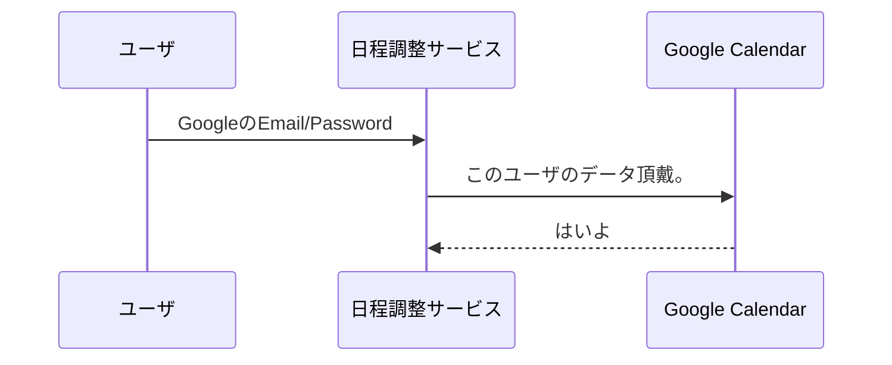
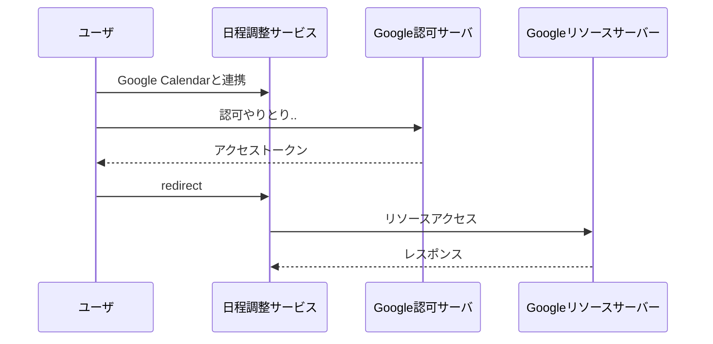
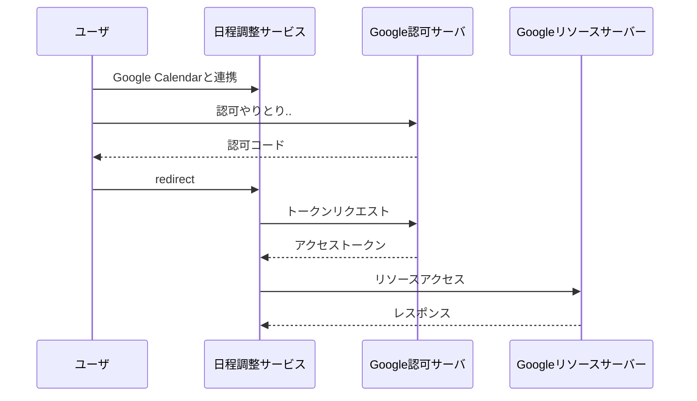

年末年始にOAuth 2.0 について調べた内容のメモです。

参考: 
- [雰囲気でOAuth2.0を使っているエンジニアがOAuth2.0を整理して、手を動かしながら学べる本 - Auth屋 - BOOTH](https://booth.pm/ja/items/1296585)

## OAuth 2.0 とは何か

外部サーバが管理するリソースへアクセスするにあたり、ユーザと合意を取るための一連のフローに関する仕様。よくある外部サービス連携みたいなものを作るときに、OAuth 2.0 のフローに乗ればセキュアに実装ができる。

例えば、日程調整サービスみたいなものを作るとして、ユーザのGoogle Calendarのデータを使いたいとする。その場合、Googleが管理するデータを利用して良いかどうかユーザと合意を取り、データを取得する。

色々省略して書くと、以下のようにアクセストークンを発行しリソースへのアクセスを行う。

「**ユーザと合意を取る**」というところがミソだと思う。OAuth 2.0 では、「`データはサービスプロバイダーではなくユーザのものである`」という考え方に基づく。  
先の例でいうと、Google CalendarのデータはGoogleのものではなくユーザのもの。そのため、Googleが勝手に日程調整サービスに対してデータを渡すということはせず、ユーザに確認を取る。

OAuth 2.0 は `特定のリソースに対して、ある操作を許可する` という「認可」のためのフレームワークである。認証のためのものではない。OAuth 2.0 のインプリシットグラントタイプで認証の仕組みを実装すると、脆弱性に繋がるため、Open ID Connectを使った実装をする必要がある。

## OAuth 2.0 がなぜ必要か

OAuth 2.0 ではないやり方でのデータ連携を考えてみる。その場合、Google Calendarのデータアクセスのために、GoogleのEmail/Passwordを日程調整サービスにわたす必要がある。

この設計には以下のような問題がある。

- 日程調整サービスの開発者が悪意がある場合、Googleの認証情報を使って、Google Calendarのデータ取得・更新・削除などが可能になってしまう。
- 日程調整サービスが攻撃を受けた時、GoogleのEmail/Passwordが外部に漏れる

OAuth 2.0 では、これらの問題を回避しつつデータ連携するために以下のような特徴を持っている。

- **限定的なアクセス**: 先の例でいうとユーザと合意を取る際、日程調整サービスがどのようなデータアクセスをするのかをユーザに知らせた上で合意を取る。
- **認証情報をサードパーティアプリに提供しない**: 先の例でいうとGoogleの認証情報は、Googleの認可サーバとやり取りするため、日程調整サービスには認証情報を渡さないで済む。

## グラントタイプ

OAuth 2.0 では4つのフローがあるが、ここでは

- 認可コードグラント
- インプリシットグラント

を取り上げてみる。インプリシットグラントの方は脆弱性があるため、非推奨とされている。

「インプリシットグラント」はリソースにアクセスするためのアクセストークンをクエリパラメータに付与するなどによって、クライアントに直接返す。そのため、攻撃者にアクセストークンが漏洩したり、アクセストークンを置き換えして攻撃されるなどのリスクがある。

「認可コードグラント」では、認可コードを発行しそれを使ってアクセストークンを取得する。アクセストークンのやり取りは、日程調整サービス - Google認可サーバ間でされるため、アクセストークンが漏洩したり置き換えされて攻撃されるリスクはインプリシットグラントに比べると小さい。

