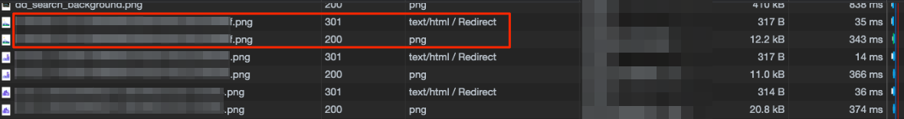

## 事象

Rails アプリの`asset_host`を設定することで、静的なアセットを CDN から配信できます。
CloudFront の設定を入れた場合、下記のようになります。`https://` などは書く必要がありません。

```rb:production.rb
config.action_controller.asset_host = 'xxx.cloudfront.net'
```

> ここに記述するのは "ホスト名" (サブドメインとルートドメインを合わせたもの) のみです。http:// や https:// などのプロトコルスキームを記述する必要はありません
> [アセットパイプライン - Rails ガイド](https://railsguides.jp/asset_pipeline.html)

上記設定を加えて本番のページで確認したところ、CloudFront 経由から配信されていることが確認できました。しかし、Network > Img タブで見てみると各画像の読み込みは 1 回目 301 ステータスを返し、オリジンサーバへリダイレクトされていました。



また、`curl`コマンドでヘッダーを確認すると、同じく 301 リダイレクトを返していました。

```shell
$ curl -I https://xxx.cloudfront.net/path-to-img
HTTP/2 301
content-type: text/html
location: ...
```

各画像につきリダイレクトが発生してしまうので、これによりパフォーマンスが悪化していたので対応する必要がありました。

## 原因と対応

CloudFront で本番用のディストリビューションを作成したとき、特に何も考えずデフォルトの設定で作成していて、Origins の設定が HTTP Only になっていました。稼働中の他のサービスのディストリビューションの設定を見た時、ここの設定が Match Viewer だったので原因がここだと考えました。

調べてみると、下記内容の記事を発見しました。

> WEB サイトが HTTP のみの場合は問題ないと思いますが、HTTPS を使っている場合は念のため動作確認するのをオススメします。私ははじめ「Match Viewer」を選択し忘れたため、コンテンツが CloudFront にキャッシュされずにオリジンサーバにリダイレクトされていました。(^^;)
> [Amazon CloudFront 設定メモ | あぱーブログ](https://blog.apar.jp/web/1245/)

今回発生している事象と同じだったので、CloudFront 側の Origin 設定で Match Viewer に変更しました。

## 確認

CloudFront の設定が反映されるまで 1 時間ほど待ち、curl コマンドで見た時にステータスコード 200 を返すことを確認しました。  
しかしこの時点では、ブラウザで確認した時、301 リダイレクトを返す状態は続いていました。

試しに別端末で CloudFront の URL を開いたところ、リダイレクトされていないことを確認したので、Chrome のキャッシュが原因と思い、キャッシュの削除をして確認すると 301 リダイレクトは消滅しました。
