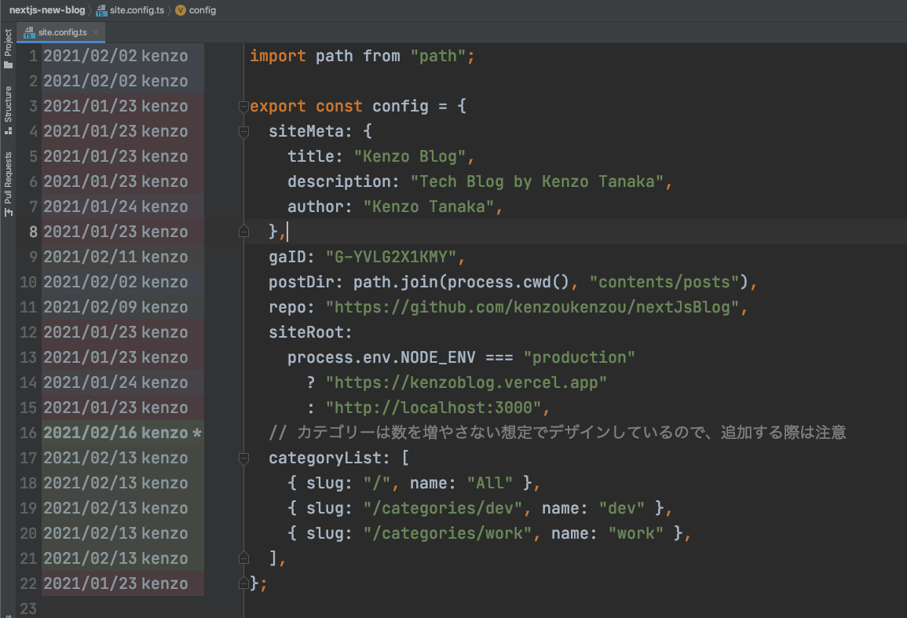
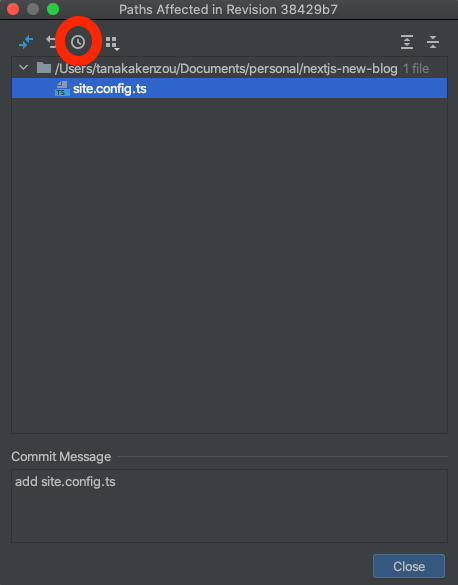
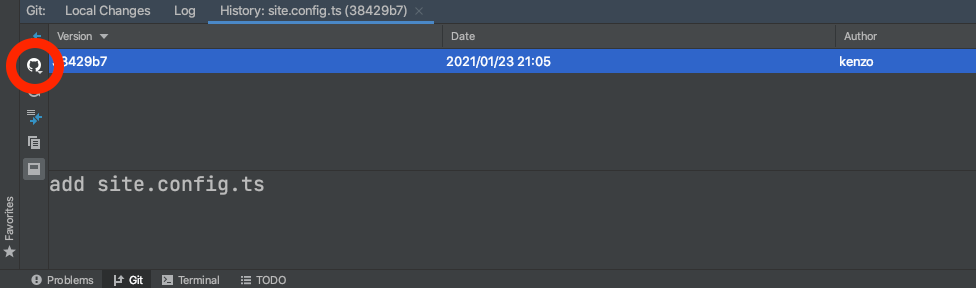

RubyMine の annotate から GitHub のコミットや Pull Request を開く方法について書きます。

適当なファイルを開いて annotate で行ごとのコミットを確認します。annotate コマンドは Keymap から自分で登録できます。僕は cmd + shfit + b に設定しています。

日付と名前になっている箇所をクリックすると、下記キャプチャのようなモーダルが開きます。キャプチャで印をつけた時計マークみたいなやつをクリックすると、Git のウィンドウを開きます。

左側の方に GitHub のアイコンがあるので、これをクリックすると Pull Request をブラウザで開くことができます。

