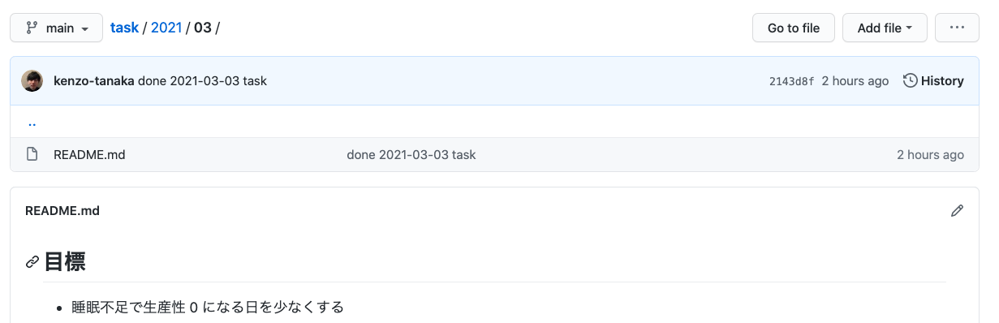

タスク管理の方法で自分にあうやり方がある程度掴めてきたので、まとめてみます。

## タスク管理に求めること

- 普段使っているツールで完結すること
- 動作が重くならないこと
- 消化したタスクを一覧で確認でき、検索できること

## エディターでタスク管理する

タスク管理用のリポジトリを作成し、月単位でフォルダを作ります。各月のフォルダの下に`README.md`を作成します。

```shell
/task
  /2021
    /02
      /README.md
    /03
      /README.md
    ...
```

こうすることによって、GitHub 管理した時フォルダに移動すればその月のタスクを閲覧できるようになります。



このファイルにマークダウン記法でタスクを書いていきます。

ファイルの中身は、下記のように `## 日付` の下にやることをチェックボックスで書いていき、タスクが完了したらチェックをいれます。タスクは優先度順に並べます。

ファイルの先頭には、その月の目標など定期的に見返したい内容を書いておきます。TODO の下には、学んだことや感想などを書きます。文章が長くなる場合は、別ファイルに切り出したりすることもあります。

```md:03/README.md
## 目標

- しっかり休む

## 2021-03-01

- [x] TODO1
- [ ] TODO2
- [ ] TODO3

学んだことや感想などを書く。
```

この方法は月間進捗を振り返りやすいので、月次で自分リリースノートを書いている自分にとてもフィットしました。またエディターや GitHub から検索をかけやすく、動作が重くならないところも良いです。

(2021-03-08追記)  
上記のフォーマットでその月の README.md を作成するスクリプトを作成しました。  
[todos.rb - gist](https://gist.github.com/kenzo-tanaka/f85997b6232ba9a9bfe0c9793a318b70)


### その他の細かいタスク

移動中など手元に PC がない環境で思い出したタスクは自分宛てにメールを送信して、後で上記の TODO に追記しています。

また、開発系の具体的な TODO や確認項目は GitHub の Issue や Pull Request のコメントに記載します。以前は Trello を使ったこともあったのですが、結局他の開発メンバーに共有するので最初から GitHub に書き出すのが良いと判断しました。

## VSCode と Alfred を使って面倒を最小化する

このタスク管理の難点が、以下の 2 点です。

- `- [ ]` を入力するのが面倒であること
- `- [x]` に変更するのが面倒であること
- 日付を入力するのが面倒であること

まずチェックボックスの問題に関しては、VSCode のエクステンションである [Markdown All in One](https://marketplace.visualstudio.com/items?itemName=yzhang.markdown-all-in-one) を使えば解消できます。次に日付の入力は Alfred のスニペットを使って解消しています。

ちなみにこの組み合わせは干渉することが分かったので、その解決策は下記の記事に書いています。

[Alfred のスニペットと VSCode の拡張機能「Markdown All in One」が干渉する件の解決策](https://kenzoblog.vercel.app/posts/alfred-conflicts-vscode-extension)

タグ付けや消化率の可視化などはできませんが、個人のタスク管理でそこまでの機能は要らないのでこれくらいシンプルなのが僕は好きです。動作の軽さを特に優先したい人には、おすすめのタスク管理方法です。
