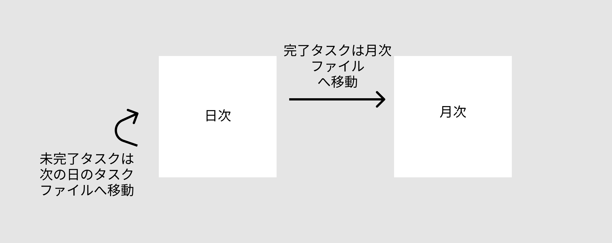

[エディターと GitHub でシンプルなタスク管理をする](https://kenzoblog.vercel.app/posts/task-manage-with-editor)という記事を先日書きました。簡単におさらいすると、以下のように月次でタスク管理をするファイルを作成してエディターで編集し、GitHub プライベートリポジトリにプッシュするというものです。

```shell
# ディレクトリ構造
/task
  /2021
    /02
      /README.md
    /03
      /README.md
    ...
```

```md:03/README.md
<!-- ファイルの中身 -->
## 2021-03-01

- [x] TODO1
- [ ] TODO2
- [ ] TODO3

学んだことや感想などを書く。
```

## 問題点

上記のやり方だと、月次のタスク管理ファイルが 100 行以上になってしまい、ファイル操作がもっさりしてしまっていました。操作が軽いというところが、この方法の最大のメリットなので解消する必要があります。

日々やることを別ファイルへ切り出して完了したら README へ追記する、未完了タスクは次の日のタスクファイルへ移行するという流れに変えました。イメージとしては以下のような感じです。


こうすれば日次のタスクファイルは重くならないですし、README はあくまで記録用になるのでファイルが重くなっても気にする必要がありません。以下は具体的なフローです。

- `tmp/yyyy-mm-dd.md`ファイルに今日やることを書き出す
- 前日のタスクファイルが`tmp/`下に残っていたら
  - この内容を`yyyy/mm/README.md` へ内容を追記する
  - 未完了タスクを今日のタスクファイルへ追記する
  - 前日タスクファイルを削除する

これを手動でやるのはストレスなので、シェルスクリプトで実行します。

```shell
#!/bin/bash

## ----------------------------------------
##  目的: 月次TODOファイルが重くなる問題を解消する
## ----------------------------------------

## ----------------------------------------
##  Define file pathes
## ----------------------------------------
past_file="tmp/$(date -v-1d +%F).md"
filename="tmp/$(date '+%Y-%m-%d').md"
readme="$(date '+%Y/%m')/README.md"

## ----------------------------------------
##  Check file existence
## ----------------------------------------
if [ -f $filename ]; then
  echo "$filename がすでに存在しています。"
  exit 1
fi

## ----------------------------------------
##  Create todays's todo file
## ----------------------------------------
heading="## $(date '+%Y-%m-%d')\n"
echo -e $heading > $filename

## ----------------------------------------
##  Clean up past file
## ----------------------------------------
if [ -f $past_file ]; then
  echo -e "\n$(cat $past_file)" >> $readme
  echo -e "$(cat $past_file | grep '^- \[ ]')" >> $filename
  rm $past_file

  echo "$past_file を削除しました。"
fi

echo '- [ ] TODO1' >> $filename
echo '- [ ] TODO2' >> $filename
echo '- [ ] TODO3' >> $filename
echo "$filename を作成しました。"
echo "ファイルに今日のTODOを書き込んでください。"
code -r $filename # Open file in new tab
exit 1
```
