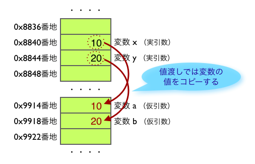

最近、[Recursion](https://recursionist.io/)というサービスを使いコンピュータサイエンスに関して学習しています。変数・メモリのところで、今まで学習してきたことと繋がった気がするので、まとめます。

## 変数とメモリ

各プログラミング言語では、値に任意の名前をつけて変数として管理ができます。JavaScript であれば、`let userId = 1;` のような感じです。

値を代入したこの変数が保存されている場所がメモリです。メモリには「メモリアドレス」というものが割り振られています。変数の実体はメモリ領域です。

| メモリアドレス |           |
| -------------- | --------- |
| `0x8836`       | 1(userId) |

変数 `userId` が呼ばれるとメモリアドレスを見に行って、値を参照できます。

## 値渡しと参照渡し

メモリの話が出てきたので、「値渡し」と「参照渡し」についても触れてみます。引数の渡し方の種類についての話で、ここでもメモリの話ができてます。

- 値渡し: 変数の値をコピーする渡し方
- 参照渡し: 変数を共有する渡し方

Ruby (に限らず多くのプログラミング言語) では「値渡し」が採用されています。下記キャプチャが分かりやすいですが、値渡しをしているので変数 x が引数 a に渡されて処理されたとしても変数 x の値自体は書き換わりません。



参照: [値渡しと参照渡しの違いを理解する](https://magazine.rubyist.net/articles/0032/0032-CallByValueAndCallByReference.html)

## ガベージコレクタと JavaScript のクロージャ

変数定義によって確保されたメモリ領域はずっと占有状態が続くのではなく、条件を満たした場合解放されます。メモリのライフサイクルは以下のようになっています。

- 必要なメモリを割り当てる
- 割り当てられたメモリを使用する
- 必要なくなったらメモリを開放する

参照: [りあクト！ TypeScript で始めるつらくない React 開発 第 3.1 版【Ⅰ. 言語・環境編】 - くるみ割り書房 ft. React - BOOTH](https://booth.pm/ja/items/2368045)

不要になったメモリ領域を解放する役割を持っているのがガベージコレクタ(GC)です。ガベージコレクタがメモリ解放の判定をするロジックは、生者から必要とされているかです。

つまり下記のような場合には、変数 `count` は生者である `increment` を通して参照されている状態なので、ガベージコレクタによって解放されません。

```js
const counter = () => {
  let count = 0;
  const increment = () => {
    return (count += 1);
  };
  return increment;
};

// この変数が定義されることによって counter の中の count 変数はGCで解放されない
const increment = counter();

console.log(increment()); // -> 1
console.log(increment()); // -> 2
```
