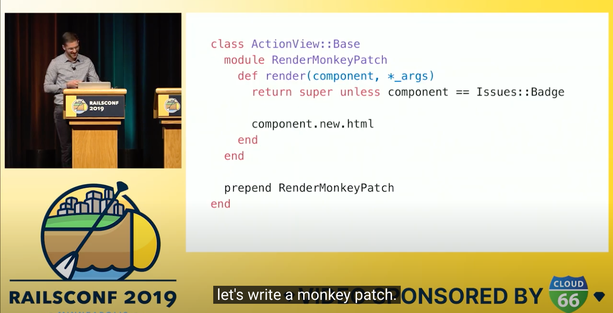

最近、[ViewComponent](https://github.com/github/view_component)というRailsのViewをコンポーネントとしてカプセル化するフレームワークを知りました。  
こちらの作者で、GitHub社の開発者である Joel Hawksley さんのRailsConf2019 での講演がYoutubeに上がっています。

- [RailsConf 2019 - Rethinking the View Layer with Components by Joel Hawksley - YouTube](https://www.youtube.com/watch?v=y5Z5a6QdA-M)

ViewComponentの背後にある課題意識が説明されていて、とても面白かったのでポイントをまとめます。

## Railsのviewが抱える課題

**テストが容易ではない**

-  RailsはViewのテストをするにはシステムspecを書く必要があるが、コストがかかる
- 特にパーシャルのテストは重複しやすく、苦痛が伴い、テストを書くこと自体をやめてしまう

**カバレッジの計測が難しい**

- [Simplecov](https://github.com/simplecov-ruby/simplecov)のようなカバレッジツールではViewのテストカバー率を計測できない

**データフローの推測が難しい**

- パーシャルは期待する引数が暗黙的なので理解しづらい

## Reactのアイデアを持ち込む

上記の課題をGitHub社では、Reactのアイデアを持ち込むことで解決していったそうです。つまりコンポーネントでViewをカプセル化して、再利用可能かつテストを容易にするということです。

- 期待するデータを明示的に書ける
- 独立して、高速に動くテストを可能にする

Componentは`app/components`下にClassで書き、`render`で呼び出す。`render`にモンキーパッチを当てる、という実装でGitHub社ではコンポーネント化を実現していたそうです。

これらのコンポーネント化の仕組みをフレームワークとして切り出したのが、[ViewComponet](https://github.com/github/view_component)です。

## ViewComponentの特徴

- テストしやすい
- データフローを理解しやすい
- パーシャルよりもパフォーマンスも高い

[Overview - ViewComponent](https://viewcomponent.org/)

GitHubも当然ですが、有名所のOSSとしては[forem](https://github.com/forem/forem)が使っています。  
作者本人が作ったデモリポジトリもあります。  
https://github.com/joelhawksley/view-component-demo

使い方等はめちゃめちゃシンプルで直感的なので、公式サイトを見て頂ければと思います。

## 個人的に感じたプロコン

まだがっつり使ったわけではないので、その点はご了承ください。

pro:

- GitHub社がアクティブに開発しているのである程度信用できそう
- コンポーネントの考え方など開発者の新しい知識習得の機会になりそう
- コンポーネントは独立してテスト可能なのでテスタビリティが高い

con:

- `xxx_component.rb` と `xxx_component.html.haml` が同じ階層に入るので、コンポーネントが増えてきたらファイルの見通しが悪くなりそう
- コンポーネントの切り方、ディレクトリ構造は開発者に委ねられているのでなど悩みそう & 無秩序になりそう
- コンポーネントのディレクトリ構造を変更する際、使用する側のコードも変更が必要になりそう
- 比較的新しいライブラリなので、ゴリゴリ使い込んでいるOSSとかがなさそう
  - [forem](https://github.com/forem/forem) とかも浅く使っている感じ
  - foremにViewComponentが入ったのは多分ここ https://github.com/forem/forem/pull/14283

その他OSS:

* [joemasilotti/railsdevs.com: The reverse job board for Rails developers.](https://github.com/joemasilotti/railsdevs.com)
* [Spina/app at master · SpinaCMS/Spina](https://github.com/SpinaCMS/Spina/tree/master/app)
* [18F/identity-idp: Login.gov Core App: Identity Provider (IdP)](https://github.com/18F/identity-idp)
* [TheOdinProject/theodinproject: Main Website for The Odin Project](https://github.com/TheOdinProject/theodinproject)

## 最後に

コンポーネントの設計なども学んでいかなくては、と思いました。
